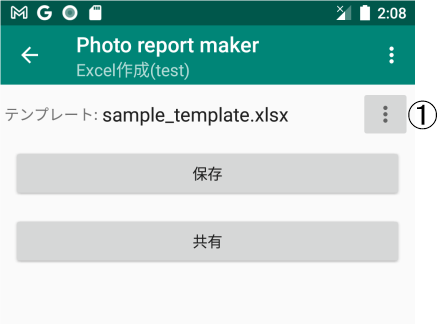
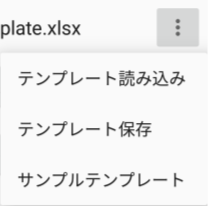
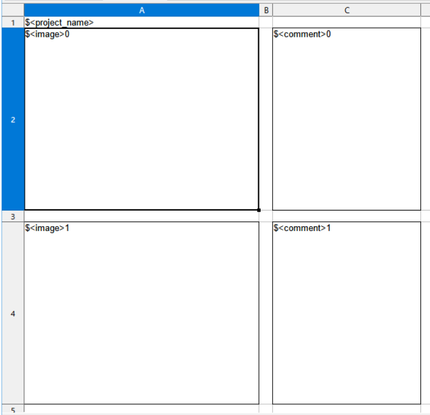
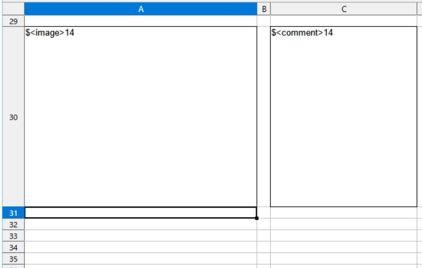
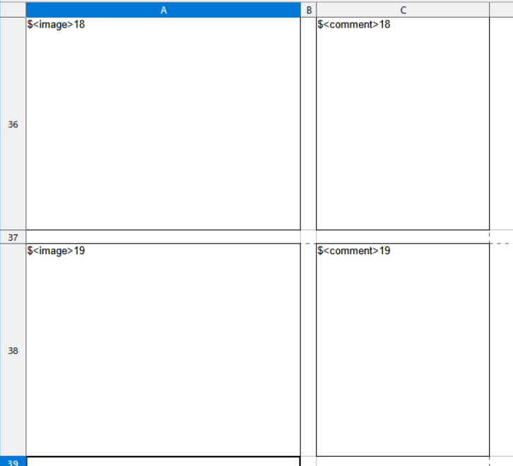

---
html:
  embed_local_images: true
  embed_svg: true
  offline: true
  toc: false
print_background: false
title: Edit excel template
---

# Excel変換用のテンプレート編集

## 手順
サンプルのテンプレートはアイテムを15個しか変換できません。
ここでは例として、テンプレートを編集してアイテムを20個変換できるようにします。

1. Excel作成画面からサンプルテンプレートファイルを保存します。
①のボタンを押します。

表示されるメニューから「テンプレート保存」を選択します。

ここではファイル名をtemplate1.xlsxとしました。

2. 保存したテンプレートファイルをExcelで開きます。
ExcelはAndroid用でもいいのですが、PC版を使ったほうが編集しやすいと思います。この例ではPC上で作業します（私はPC版のExcelを持ていないので、LibreOfficeのCalcを使っていますが、以降編集に使うアプリをExcelと書きます）。

1. Excelでテンプレートファイルを編集します。
Sheet1を確認すると、"\$\<image>0"のタグが見えます。

シートを下まで見ていくと、"\$\<image>14"まであることがわかります。このタグが15個のアイテムの写真に置き換わります。

また、"\$\<comment>0"から"\$\<comment>14"はコメントになります。
1. アイテムを20個まで増やします。そのために、"\$\<image>15"から"\$\<image>19"まで追加します（同じようにコメントも追加します）。

1. 編集が終わったら、写真帳アプリのExcel作成画面へ戻り、メニューの「テンプレート読み込み」から編集したテンプレートファイルを読み込みます。

これで20枚までアイテムを表示できるようになります。

## 使えるタグ

\$\<project_name> : プロジェクト名
\$\<date> : 日付（使う場合は、セルの書式を日付に変更してください）
\$\<image>i : 画像（"i"はアイテム番号）
\$\<comment>i : コメント（"i"はアイテム番号）

## 終わりに
写真帳をExcelファイルに変換する時、あらかじめテンプレートを作っておけば変換後の修正が最小限で済みます。ぜひ自分の目的に合わせてテンプレートを編集してください。
おまけでアイテムを50個に増やしたテンプレートを以下のリンクに置いておきます。
[sample_template_50.xlsx](./sample_template_50.xlsx)

