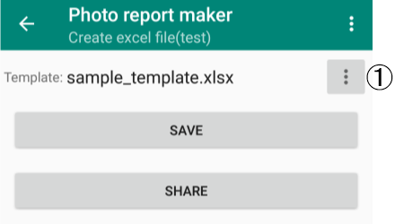
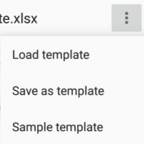

---
html:
  embed_local_images: true
  embed_svg: true
  offline: true
  toc: false
print_background: false
title: Edit excel template
---

# Edit template for Excel conversion

## Procedure

The sample template can only convert 15 items.
As an example, let's edit the template so that 20 items can be converted.

1. Save the sample template file from the Excel creation screen.
Press button ①.

Select "Save as template" from the menu that appears.

Here, the file name is template1.xlsx.

2. Open the saved template file in Excel.
You can use Excel for Android, but I think it's easier to edit if you use the PC version. In this example, I will be working on a PC (I don't have a PC version of Excel, so I'm using LibreOffice's Calc, but from now on I'll refer to the app I use for editing as Excel).
1. Edit the template file in Excel.
If you check Sheet1, you will see the tag "\$\<image>0".

If you look at the bottom of the sheet, you will see that there are up to "\$\<image>14". These tags will be replaced with 15 item photos.

Also, "\$\<comment>0" to "\$\<comment>14" are comments.
1. Increase the number of items to 20. To do this, add "\$\<image>15" to "\$\<image>19" (add a comment as well).

3. When editing is complete, return to the Excel creation screen of the Photo Book app and load the edited template file from "Load template" in the menu.

Now you can display up to 20 items.

## Usable tags

\$\<project_name> : Project name
\$\<date> : Date (If you want to use it, change the cell format to date)
\$\<image>i : Image ("i" is the item number)
\$\<comment>i : Comment（"i" is the item number）

## Afterword
When converting a photo book into an Excel file, if you create a template in advance, you can minimize modifications after conversion. Please feel free to edit the template to suit your purposes.
A template with an additional 50 items is available at the link below.
[sample_template_50.xlsx](./sample_template_50.xlsx)

