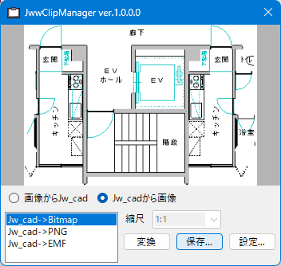

[Top](https://junkbulk.com)

[開発支援について](../donate/index.html)

# JwwClipMonitor
## 概要
JwwClipMonitorは、Windowsのクリップボードにコピーされた画像ファイルをJw_cadの形式に変換、もしくは逆にJw_cadでコピーされた図形を各種画像形式に変換するアプリです。
- クリップボードにある画像（Bitmap, DIB, PNG, EMF）をJw_cadの形式に変換し、Jw_cadに貼り付けることができます。
- クリップボードにあるJw_cadでコピーした図形を画像（Bitmap, PNG, EMF）として対応するアプリに張り付けることができます。
- 保存ボタンで対応するクリップボードデータを保存することができます。
- 無料で使うことができますが、よかったら[開発支援](https://junkbulk.com/windows/donate/index.html)をお願いします。

## 2. Download
- JwwClipMonitor ver1.0.1.2
JwwClipMonitor-1.0.1.2.zip (MD5 : 8d410c7c63e126d07f7565c15d24d6e5)
[ダウンロード](download/JwwClipMonitor-1.0.1.2.zip)  (1470KB)
[Vectorからダウンロード](https://www.vector.co.jp/soft/winnt/business/se527100.html)

- JwwClipMonitor ver1.0.0.0
JwwClipMonitor-1.0.0.0.zip (MD5 : e40865327a67f1e0daab2b8e82deb6a2)
[ダウンロード](download/JwwClipMonitor-1.0.0.0.zip)  (1470KB)
  
## 3. 使い方
- [readme.html](readme.html)

