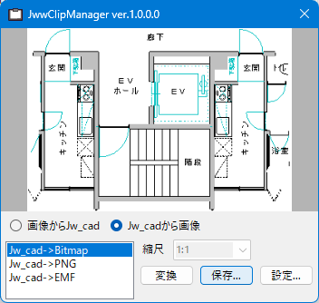

[[Top]](https://junkbulk.com)  [[開発支援について]](../donate/index.html)

# 概要
JwwClipMonitorは、Windowsのクリップボードにコピーされた画像ファイルをJw_cadの形式に変換、もしくは逆にJw_cadでコピーされた図形を各種画像形式に変換するアプリです。

- クリップボードにある画像（Bitmap, DIB, PNG, EMF）をJw_cadの形式に変換し、Jw_cadに貼り付けることができます。
- クリップボードにあるJw_cadでコピーした図形を画像（Bitmap, PNG, EMF）として対応するアプリに張り付けることができます。
- 保存ボタンで対応するクリップボードデータを保存することができます。
- 無料で使うことができますが、よかったら[開発支援](https://junkbulk.com/windows/donate/index.html)をお願いします。

# Download

[JwwClipMonitor ver1.1.0.0](download/JwwClipMonitor-1.1.0.0.zip)
: > JwwClipMonitor-1.1.0.0.zip  
Size:   1470KB  
MD5:    a6948452cf27a6785503ee094f9252b7

Vector  
<https://www.vector.co.jp/soft/winnt/business/se527100.html>

github  
<https://github.com/JinkiKeikaku/JwwClipMonitor>

# 使い方

[readme.html](readme.html)を参照してください。

