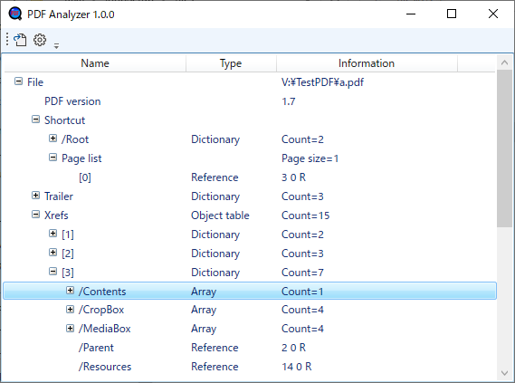

[Top](https://junkbulk.com)

[開発支援について](../donate/index.html)

# PDF Analyzer
## 1. 概要
- PDF AnalyzerはPDFファイルの構造を理解しやすくするためのプログラムです。PDFのリファレンスマニュアルやPDFの構造を解説したホームページを見ながら使ってみてください。
- フリーソフトウェアです。無料で使用できますが、[開発支援](..donate/index.html)のカンパをお願いします。

## 2. Download
- Vectorからダウンロード　https://www.vector.co.jp/soft/winnt/writing/se524513.html
- [PdfAnalyzer-1.0.0.zip](https://www.vector.co.jp/soft/winnt/writing/se524513.html) (2022/6/27)
ver1.0.0

## 3. 使い方
- [readme.html](readme.html)
## 画面

