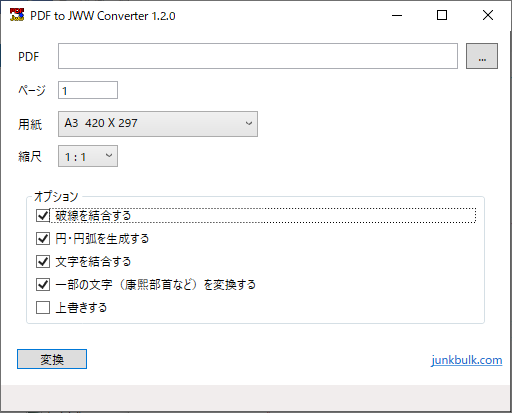

[[Top]](https://junkbulk.com)  [[開発支援について]](../donate/index.html)

# 概要
- PDFファイルをJw_cadのjwwファイルまたはDXFファイルに変換するプログラムです。
- GUI版とCUI版があります。
- 動作環境はWindows11です。
- フリーソフトウェアです。無料で使用できますが、[開発支援](../donate/index.html)のカンパをお願いします。

# Download

[PDF to JWW Converter v1.3.0.0](download/PdfToJww-1.3.0.0.zip)
: >  PdfToJww-1.3.0.0.zip  
Size:   1664KB  
MD5:    5c2855647f2118a482eab4d872f9e994
    

[PDF to JWW Converter v1.2.1](download/PdfToJww-1.2.1.zip)  
:  > PdfToJww-1.2.1.zip  
Size:   1401KB  
MD5:    1ebe5cf6204e9bc494708c946f120a7a

[PDF to JWW Converter v1.2.0](download/PdfToJww-1.2.0.zip)
:  > PdfToJww-1.2.0.zip  
Size:   1402KB  
MD5: 27f753630f756d820f334e5ad02380f0

Vector  
<https://www.vector.co.jp/soft/winnt/business/se524472.html>

github  
<https://github.com/JinkiKeikaku/PdfToJwwConverter>
 
# 使い方
[readme.html](readme.html)を参照してください。

# 画面

