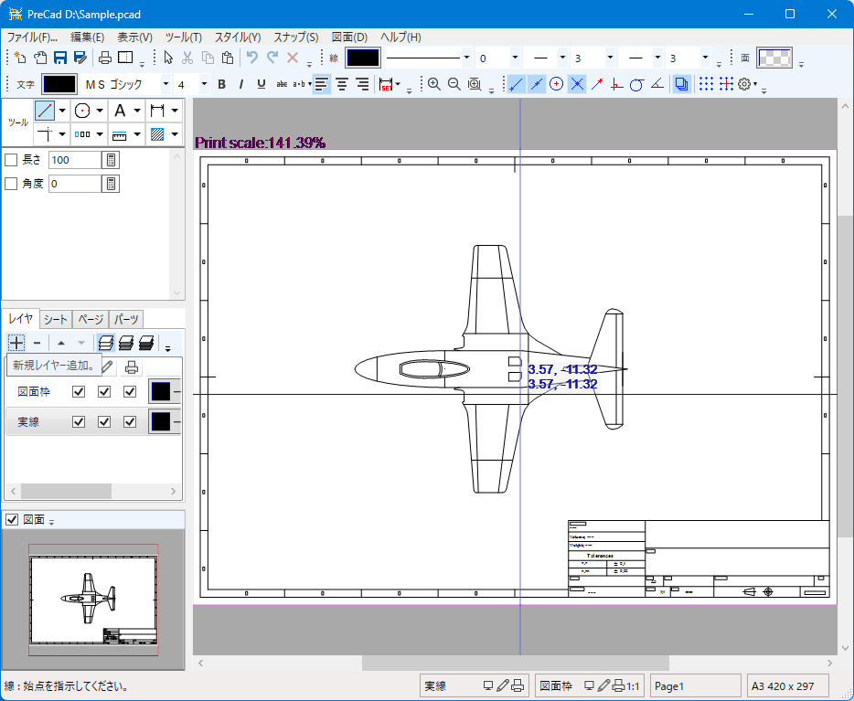

<a href=index_en.html>English</a>

[Top](https://junkbulk.com)

[開発支援について](donate_ja.html)

# PreCad for Windows

## 1. 特徴 
- マルチページ対応の2DCAD
- レイヤ数制限なし
- シート機能により一つの図面に複数の縮尺を設定可能
- 対応ファイル形式 
  - PreCad(*.pcad)
  - Jw_cad(*.jww, *.jwc)（jwcは読み込みのみ）
  - DXF(*.dxf)
  - SFC(*.sfc)（読み込みのみ）
  - LilliCad(*.lcd)（読み込みのみ）
  - SakraCad(*.skc)
  - HPGL(*.hpgl, *.hgl)
  - SVG(*.svg)
  - PDF(*.pdf)（読み込みのみ）
  - PNG(*.png)（保存のみ）

- Jw_cadの線記号変形利用可能
- Jw_cadの図形ファイル(*.jws)をパーツとして使用可能
- Androidバージョンもあります（ただし、ソースコードも開発言語も違うので別物です）
[PreCad for Android](https://play.google.com/store/apps/details?id=com.junkbulk.precad)

## 2. Download
- PreCad ver1.0.1.0
PreCad-1.0.1.0.zip (MD5 : c918d3ce6d854ae78295ce1e56c9a92d)
[ダウンロード](download/PreCad-1.0.1.0.zip)
[ベクターからダウンロード](https://www.vector.co.jp/soft/dl/winnt/business/se526259.html)

## 3. 使い方
- インストール方法など
[Readme](readme_ja.html)
- マニュアル
[PreCAD_windows_manual.html](manual/ja/PreCAD_windows_manual.html)

## 4. 資料
- [ファイルフォーマット v2.4.0 rev1](download/PreCadFormat_v2_4_0_rev1.html)