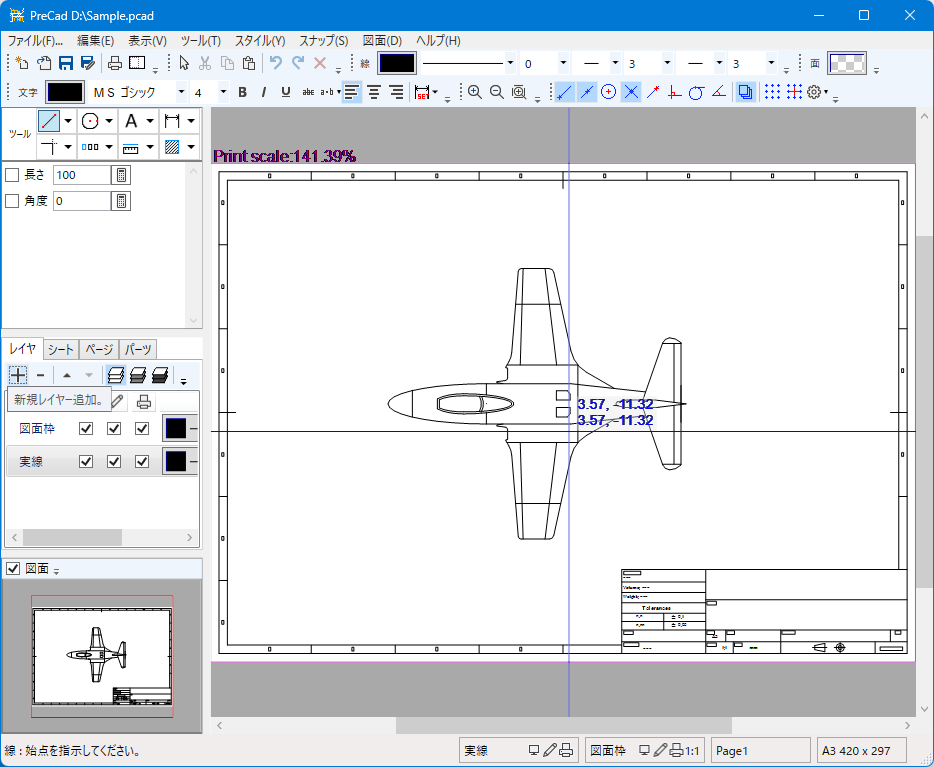

<!-- 
<a href=index.html>Japanese</a>
 -->
[[Top]](https://junkbulk.com)  [[Donation]](donate_en.html)  [[Japanese]](index.html)

# Features

- 2DCAD with multi-page support
- No limit on number of layers
- Multiple scales can be set for one drawing using the sheet function
- Supported file formats
   - PreCad(*.pcad)
   - Jw_cad(*.jww, *.jwc) (jwc is read only)
   - DXF(*.dxf)
   - SFC(*.sfc) (read only)
   - LilliCad(*.lcd) (read only)
   - SakraCad(*.skc)
   - HPGL(*.hpgl, *.hgl)
   - SVG(*.svg)
   - PDF(*.pdf) (read only)
   - PNG (*.png) (save only)
- Jw_cad line symbol modification available
- Jw_cad parts files (*.jws) can be used as parts
- There is also an Android version (but it is different because the source code and development language are different)  
[PreCad for Android](https://play.google.com/store/apps/details?id=com.junkbulk.precad)

# Download

[PreCad v1.10.2.0](download/PreCad-1.10.2.0.zip)
: > PreCad-1.10.2.0.zip  
Size: 3132KB  
MD5: 7b9a33e79287bda1bde2bb9655388304

[PreCad v1.10.1.0](download/PreCad-1.10.1.0.zip)  (3128KB)
: > PreCad-1.10.1.0.zip  
Size: 3128KB  
MD5: 742f56e37fa1bb83539624ea5de6db58

[PreCad v1.10.0.0](download/PreCad-1.10.0.0.zip)  
: > PreCad-1.10.0.0.zip  
Size: 3125KB  
MD5: 006c9674cf298e42ebbc9465e430cee5

# How to use  

- Installation method  
[Readme](readme_en.html)  
- Manual  
[PreCAD_windows_manual.html](manual/en/PreCAD_windows_manual.html)

# Documentation  

- [File format v2.11.0 rev0](download/PreCadFormat_v2_11_0_rev0.html)  
- [Coordinate file format](download/PrecoFormat_en.html)  

# Tools  

- [PreCadExplorer](download/PreCadExplorer.zip)
An app for checking the file structure of PreCad document files.

