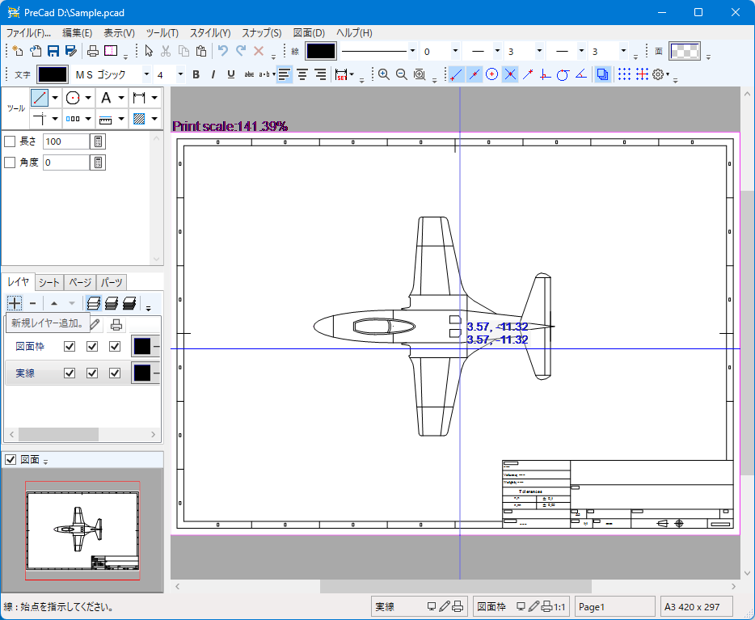

<a href=index.html>Japanese</a>

[Top](https://junkbulk.com)

[Donation](donate_en.html)

# PreCad for Windows

## 1. Features
- 2DCAD with multi-page support
- No limit on number of layers
- Multiple scales can be set for one drawing using the sheet function
- Supported file formats
   - PreCad(*.pcad)
   - Jw_cad(*.jww, *.jwc) (jwc is read only)
   - DXF(*.dxf)
   - SFC(*.sfc) (read only)
   - LilliCad(*.lcd) (read only)
   - SakraCad(*.skc)
   - HPGL(*.hpgl, *.hgl)
   - SVG(*.svg)
   - PDF(*.pdf) (read only)
   - PNG (*.png) (save only)
- Jw_cad line symbol modification available
- Jw_cad parts files (*.jws) can be used as parts
- There is also an Android version (but it is different because the source code and development language are different)
[PreCad for Android](https://play.google.com/store/apps/details?id=com.junkbulk.precad)

## 2. Download

- PreCad ver1.1.1.1
PreCad-1.1.1.1.zip (MD5 : 2034a925f8439be9f1d8e0b405475d48)
[Download](download/PreCad-1.1.1.1.zip)  (2982KB)

- PreCad ver1.1.1.0
PreCad-1.1.1.0.zip (MD5 : c65d4951064dec87decbad991da76f3a)
[Download](download/PreCad-1.1.1.0.zip)  (2710KB)

- PreCad ver1.1.0.2
PreCad-1.1.0.2.zip (MD5 : 3fb9638d6263237629a438c6067c6862)
[Download](download/PreCad-1.1.0.2.zip)  (2702KB)

  
## 3. How to use
- Installation method.
[Readme](readme_en.html)
- Manual
[PreCAD_windows_manual.html](manual/en/PreCAD_windows_manual.html)

## 4. Documentation
- [File format v2.4.1 rev1](download/PreCadFormat_v2_4_1_rev1.html)