---
html:
   embed_local_images: true
   embed_svg: true
   offline: true
   toc: true
print_background: false
title: PreCad (Windows) Manual
---

# About this manual
The manual is not yet up-to-date. Therefore, there are difference between the manual and the actual functionality.
I recommend referring to the tooltips on buttons and other elements within the app for instructions on how to use the app.

# Screen Layout

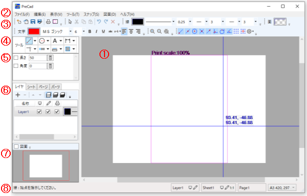

## Editing Screen
### Mouse Operations
You can create shapes using the mouse with the [Drawing Tools](#DrawTools). The mouse operations used for drawing are as follows:

- Left Click  
Specifies coordinates at the clicked position. Depending on the tool, you can constrain the direction of movement vertically and horizontally by clicking while holding down the Shift key.

- Left Double Click  
Used to end operations, etc., depending on the tool.

- Right Click  
Displays a menu. Assigned to ending shape selection, depending on the tool.

- Left Button Drag  
Used to select shapes within a range, etc., depending on the tool.
The selection tool allows you to select all shapes within a range by dragging from left to right, and select shapes that are partially within the range by dragging from right to left.
- Mouse Wheel  
    - Rotating zooms in and out.  
    - Dragging scrolls the image.  
    - Holding down the Shift key while dragging zooms in on the area.  
    - Holding down the Shift key while clicking moves the selected area to the center of the screen.  

### Cursor

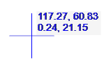

- The cursor displays coordinate values ​​in two lines. The top line shows coordinates relative to the grid origin, and the bottom line shows coordinates relative to the anchor. The anchor is the point you last clicked, or a coordinate determined by the tool you're using. For example, with the arc tool, the center of the circle is the anchor.

- You can turn the display of coordinate values ​​on and off from the [View Menu](#ViewMenu).  
- Normally, the cursor is blue, but it changes to red when snapping. When snapping, a mark indicating the type of snap is displayed in the upper left corner of the cursor. See [Snap Toolbar](#SnapToolBar) for information on the displayed marks.  
- There are two types of cursors: a crosshair cursor and a full-screen crosshair cursor that draws a line to the edge of the screen. You can switch between them using the [View Menu](#ViewMenu).  

## Menus  
Commands can be executed from the top menu. Some (though not all) of the commands in the menu are also available on the toolbar.  
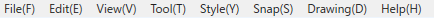  

### File  

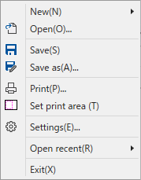  

1. New  
There are two options: Create New File and Create New File from Template.
Create New File from Template creates a new file based on a pre-existing file.  
1. Open  
Opens the File Open dialog.  
3. Save  
Saves the file. If there is no file name yet, the File Save dialog will open; please enter a file name.  
4. Save As  
Opens the File Save dialog.  
5. Print  
Opens the Print dialog.  
6. Print Area Settings  
Switches to the Print Area Settings tool. The cursor position will be the center of the print area. The following options will appear in the tool panel  
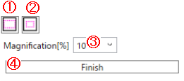

    i. Adjust the print area to fit the paper and change the magnification.  
    i. Move the print area to the center.  
    i. Print magnification.  
    i. Exit the print area setting tool and return to the original tool.  

1. Settings  
Allows you to configure various settings.  
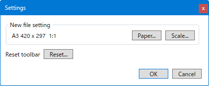  

      i. New File Settings  
         Sets the default paper size and scale when creating a new file.
      i. Toolbar Reset  
         Resets the toolbar layout. The toolbar will be reset after restarting.  
1. Recently Opened Files  
Recently opened files are displayed and can be selected.  
1. Exit  
Exits this application.  

### Edit

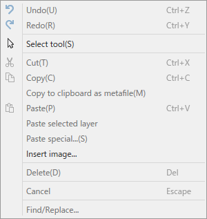

1. Undo  
Reverts the last edited action.  

1. Redo  
Redoes the action that was undone.  

3. Select Tool  
A tool for selecting, moving, and transforming shapes (see Selection Tool (#SelectTool)). It offers various functions.  

2. Cut  
Cuts the shape selected with the Selection Tool and copies it to the clipboard.  

3. Copy  
Copies the shape selected with the Selection Tool to the clipboard.  

1. Copy to Clipboard as Metafile  
Copies the shape selected with the Selection Tool as a metafile.  

2. Paste  
Pastes the shape from the clipboard. The pasted shape appears in the center of the editing screen.  

2. Paste Selected Layer  
Normal pasting pastes to the source layer, but this pastes to the currently selected layer.  

1. Paste Special  
Select various formats (such as PNG) from the dialog box and paste.  

1. Insert Image  
Select an image file and paste it.  

1. Delete  
Delete the shape selected with the selection tool.  

1. Set  
Click again at the location where you last clicked with the mouse. When this item is   selected from the right-click menu, it is the location where you right-clicked.

1. Offset  
A dialog box opens. Enter an offset value, and the cursor will click at a coordinate shifted by the offset value from the location where you last clicked with the mouse. When this item is selected from the right-click menu, the location where you right-clicked is the reference point.

1. Mid point  
The midpoint of the location where you last clicked with the mouse and the location where you will next click becomes the click location. When this item is selected from the right-click menu, the location where you right-clicked is the starting point.

2. Cancel  
Cancels the operation being edited (same as pressing the ESC key).

3. Find/Replace  
Allows you to search and replace text. This is enabled with the selection tool.

### View

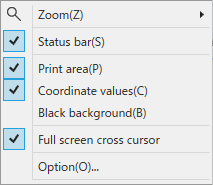

1. Zoom  
The submenu includes options for zooming out, zooming in, fitting to paper, and fitting to all shapes.

2. Status Bar  
Toggles the display/hide of the status bar at the bottom of the screen.

3. Print Area  
Toggles the display/hide of the print area.

4. Coordinate Values  
Toggles the display/hide of the cursor's coordinate values.

5. Black background  
Toggles the background color between white and black. When the background color is black, the line color switches between white and black.

6. Full screen crosshair cursor  
Toggles between a crosshair cursor and a full-screen crosshair cursor that draws a line to the edge of the screen.

1. Option  
The options settings dialog box is displayed.  
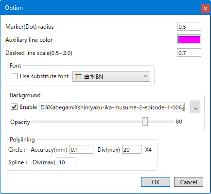  

    i. Marker(Dot) radius  
    Specify the radius of the dot marker type here.  
    i. Auxilary line color  
    You can change the guide line color here. Be careful, as using a color close to the background color may make it difficult to see.
    i. Dashed line scale
    You can change the dashed line pitch. Please enter a value between 0.5 and 2.0.
    i. Font  
    This specifies whether to use an alternative font if a font not installed on your computer is used.
    Usually, Windows will handle it appropriately even if you don't specify it, but in Wine, not specifying it may cause garbled characters.
    i. Background  
    You can set an image as the background of the editing screen. Enable it and choose your favorite image.  
    Lowering the opacity will allow the paper to show through and the image will be more visible.  
    i. Polylining  
    This sets the criteria for dividing circles (including arcs) and splines (Bezier curves) into lines.  
    The number of divisions for circles has circle precision and maximum division. Setting the precision to 0 will always divide it to the maximum number of divisions. Enter a value of 1/4 for the maximum number of divisions of a circle (the actual circle used will be 4 times this value).  
    These values ​​are also used for intersection detection during hatching, so setting them too coarse will affect the calculation results.  
    Conversely, setting them too fine will affect the amount of data and processing time after conversion, so please set an appropriate value.  

### Tools

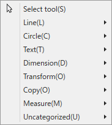

1. Favorite Tools  
You can register frequently used tools and access them from here. Registration is done from Customization.  

1. Recent Tools  
You can access recently used tools from here.  

1. Tools  
You can access tools by category. For details, please refer to [Tool Panel](#ToolPanel).

1. Customize  
Register your favorite tools from here.  
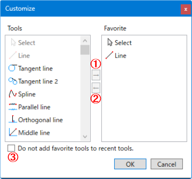  
The tool list is on the left, and the favorites list is on the right.  
Select the tool you want to add to your favorites from the tool list, and add it to the favorites list with button (1).  
The button (2) removes the selected tool from the favorites list.  
Checking (3) will prevent tools already in your favorites list from being added to recent tools when used.  

1. Shortcut  
Customize your shortcuts from here.  
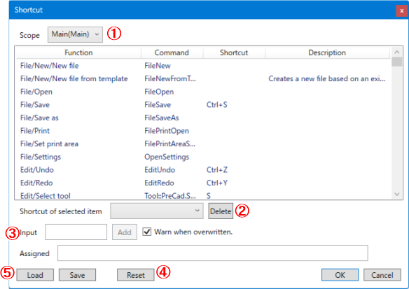
    i. Switch the shortcut scope. There are scopes for each tool (not all tools) and "Main". The Main scope is for shortcuts common to the app. Tool shortcuts are only valid when that tool is selected.  
    Shortcuts cannot be assigned to the same key for different commands. However, the same key can be assigned between tools.  
    i. The combo box displays the shortcut for the item selected in the list above. You can delete it with the delete button.  
    i. Enter the shortcut in the text box. Shortcuts can be made using each key and combinations of Shift and Ctrl (the Alt key cannot be used as it conflicts with the menu). After entering the shortcut, press the add button to add it. Checking "Warn on overwriting" will display a warning if the same key is already in use.
    i. Reset returns all shortcuts to their default values.  
    i. "Save" and "Load" allow you to save and load shortcut settings to and from a file.  

### Style  

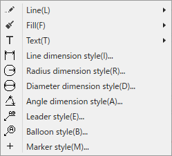  

You can set the style of the shape here. The same items are also available in the toolbar; please refer to the toolbar for details.  

### Snap  

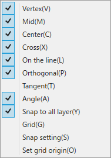  

Snap status and settings (see [Snap Toolbar](#SnapToolBar)).  

### Drawing  

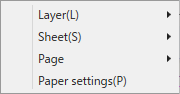  

You can set layers, sheets, and pages, but the [Document Panel](#DocumentPanel) and [Status Bar](#StatusBar) are more user-friendly.

### Help

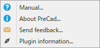

1. Manual  
Opens the manual.

2. About PreCad  
Displays information about PreCad.

3. Send Feedback  
Please use this to send any questions to the author. Your email client will open, and the author's contact information will be in the recipient field, and the app name and version will be in the subject line. Please write your message in the body of the email.  
4. Plugin Information  
Many of PreCad's functions are made up of plugins. This information will be displayed.  

## Toolbar

### File Toolbar

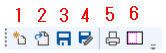

1. New  
1. Open  
1. Save  
1. Save File As  
1. Print  
The print dialog box will appear. Select your printer, paper type, etc., and press the print button to print.  
1. Print Area Settings  
This determines the area that will be printed on the current printer's paper.

### Edit Toolbar

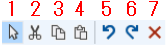

1. Selection Tool  
This tool selects shapes and moves and transforms them (see [Selection Tool](#SelectTool)). It can do many things.

2. Cut  
Cuts the shape selected with the Selection Tool and copies it to the clipboard.

3. Copy  
Copys the shape selected with the Selection Tool to the clipboard.

4. Paste  
Pastes the shape from the clipboard. The pasted shape appears in the center of the editing screen.

5. Undo  
Undoes the last edit.

6. Redo  
Redoes the undo operation.

7. Cancel  
Cancels the current edit (same as the ESC key).

### Line Style Toolbar

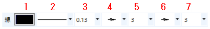

1. Line Color  
Selects the line color. [L] uses the [Layer color](#LayerStyle).
1. Line Type  
Select the line type. [L] uses the [Layer line type](#LayerStyle). [A] is a non-printable line (construction line).
1. Line Weight  
Select the line weight. [L] uses the [Layer line weight](#LayerStyle).
1. Start Arrow Type  
1. Start Arrow Size  
1. End Arrow Type  
1. End Arrow Size  

### Face Style Toolbar

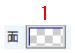

1. Face Color  
Select the face color. [L] uses the [Layer Color](#LayerStyle).

### Text Style Toolbar
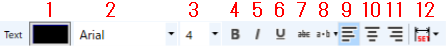

1. Text Color  
Select the text color. [L] uses the [Layer Color](#LayerStyle).  
1. Font Name  
1. Font Size  
Units are in mm.  
4. Bold  
5. Italic  
6. Underline  
7. Strikethrough  
8. Settings  
Opens a settings window where you can configure other font settings.  
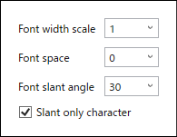  

    i. Character Width Ratio  
    Character width scaling factor  
    i. Character Spacing  
    Spacing between characters
    i. Slant Angle  
    Character slant angle. A rightward slant is considered positive.
    i. Slant Text Only  
    Checking this option slants each character, but the background frame remains slant. Image 1 below shows the option unchecked, and image 2 shows it checked.  
      
1. Left-aligned text  
1. Center-aligned text  
1. Right-aligned text  
12. Dimension line settings  
You can set dimension lines, leader lines, points, etc. from here.

### Zoom Toolbar

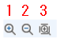  

1. Zoom In  
1. Zoom Out  
1. Displays the entire page.  
1. Zooms to fit the drawing area of ​​all shapes.  

### Snap Toolbar

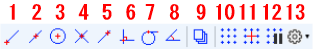

Checking this option fixes the cursor position when approaching endpoints of shapes, etc.

1. Endpoint  
Endpoints of lines, vertices of polygons, etc. A "V" appears on the cursor when snapping.

1. Midpoint  
Midpoints of lines, quarter points of circles, etc. A "M" appears on the cursor when snapping.

1. Center  
Center of a circle, etc. A "C" appears on the cursor when snapping.  
1. Intersection  
Intersections of lines on the same layer. An "X" appears on the cursor.  
1. On Line  
Snaps onto lines. An "L" appears on the cursor.  
1. Orthogonal  
Points perpendicular to lines or circles. A "P" appears on the cursor.  
1. Tangent  
Points tangent to a circle. A "T" will appear on the cursor.  
1. Angle  
The cursor position is constrained for each angle. An "A" and the angle will be displayed on the cursor when snapping.  
1. Snap to All Layers  
When checked, snaps to shapes on all layers of the same sheet.  
1. Grid  
The grid will be displayed, and the cursor will snap when it approaches the grid. A "G" will appear on the cursor when snapping.  
1. Grid Origin Setting  
Enters grid origin setting mode. Click the mouse at the desired origin location on the editing screen.  
1. Pause Snapping  
Temporarily pauses all snapping.  
1. Snap Settings  
Opens the snap settings dialog. You can set the number of grid divisions and the angle of angle snapping.  
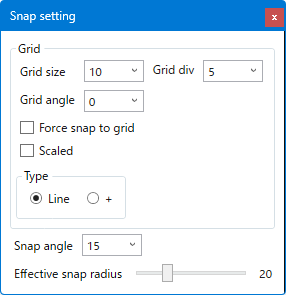  
    i. Grid size  
    Grid spacing.  
    i. Grid div  
    Number of sub-grid divisions.  
    i. Grid angle  
    You can set a tilt angle for the grid.  
    i. Force snap to grid  
    When checked, the object will always snap to the grid when there are no other points to snap to besides the grid.  
    i. Scaled  
    When checked, the grid spacing will be the effective value of the scale.  
    i. Type  
    Grid type. You can choose between straight lines and +.  
    i. Snap angle  
    Set the angle for angle snapping here.
    i. Effective snap radius  
    The distance from the mouse cursor position to find a snap point.

## Tool Panel

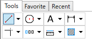

Select [Drawing Tools](#DrawTools) from here. There are tabs for Tools, Favorites, and Recent.

1. Tools  
Select a tool from the categories. The categories are "Line," "Circle," "Text," "Dimension," "Transform," "Copy," "Measure," and "Other."  
Pressing the displayed icon selects the tool associated with that icon. Pressing the triangle button next to the icon displays a list of tools included in the category; select the one you want.  
1. Favorites  
You can register frequently used tools and access them from here. Registration can be done from "Customize" in the "Tools" menu.  
3. Recent  
This displays the tools you have used recently.  

## Tool Options Panel

This panel is for entering numerical values ​​for length, angle, and other settings that can be configured in the [Drawing Tools](#DrawTools).

## Document Panel

Contains tabs for Layer, Sheet, Page, and Parts.

### Layer Tab  
This is where you configure layer settings and select the layer to write on.  
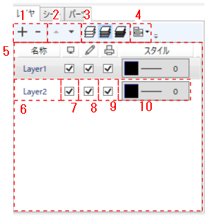  

1. Add/Delete Layer buttons. Deletion is not possible if there is only one layer.
2. Move Layer Order button. Rearranges the order of selected layers. You can also rearrange the order by dragging the layer name in the layer list.  
3. Layer Display button. From left to right: All layers visible, all layers grayed out except selected, only selected layers displayed.  
1. Menu button. The following menus are displayed:  
    - [Turn all visible flags ON/OFF] Turns all visible flags on/off in the list.  
    - [Turn all editable flags ON/OFF] Turns all editable flags on/off in the list.  
    - [Turn all printable flags ON/OFF] Turns all printable flags on/off in the list.  
    - [Layer Settings] A dialog box for setting the layer name, etc., will appear (you may not need to use this as the items that can be set in this dialog box can be edited directly from the layer list).  
1. Layer List. A list of layers is displayed. Layers are displayed stacked on top of each other on the screen, with those lower down in the layer list being the ones at the bottom.  
1. Layer Name. You can edit it by double-clicking or pressing the F2 key. To finish editing, press the Enter key to confirm, and the Esc key to cancel. You cannot enter an unnamed layer or a name that is the same as another layer.  
1. Layer Show/Hide Toggle. Even when a layer is hidden, the selected layer will still be displayed. Also, hidden layers will not be printed.  
1. Editable/Non-Editable Toggle.  
1. Printable/Non-Printable Toggle.  

1. Layer Style. Clicking this allows you to specify the layer's color, line type, and line thickness.  
    - Line color  
    This is the line color used when the shape's line color is set to L (ByLayer).  
    - Line type  
    This is the line type used when the shape's line type is set to L (ByLayer).  
    - Line width  
    This is the line width used when the shape's line width is set to L (ByLayer).  

### Sheet Tab
This is where you configure sheet settings and select the sheet to write on.  
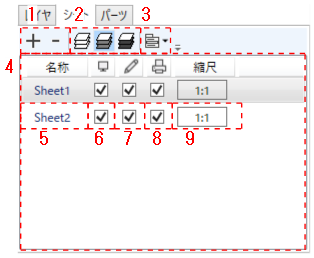  

1. Add/Delete Sheet Buttons. Deletion is not possible if there is only one sheet.  
1. Sheet Display Buttons. From left to right: All Sheets Visible, Unselected Sheets Grayed Out, Selected Sheet Only Displayed  
1. Menu Button. The following menus are displayed:  
    - [Turn All Visible Flags ON/OFF] Turns all visible flags on the list ON/OFF.
    - [Turn All Editable Flags ON/OFF] Turns all editable flags on the list ON/OFF.
    - [Turn All Printable Flags ON/OFF] Turns all printable flags on the list ON/OFF.
    - [Sheet Settings] A dialog box for setting the sheet name, etc., will appear (you may not need to use this as the items that can be set in this dialog box can be edited directly from the sheet list).
1. Sheet list. A list of sheets is displayed.
5. Sheet name. You can edit by double-clicking or pressing the F2 key. To finish editing, press the Enter key to confirm, and the Esc key to cancel. You cannot enter an unnamed sheet or a name that is the same as another sheet.
6. Sheet Show/Hide Toggle. Even when hidden, selected sheets will be displayed. Also, hidden sheets will not be printed.
7. Editable/Not Editable Toggle.
8. Printable/Not Printable Toggle.
9. Scale Button. Clicking this will display the scale setting dialog box.

### Page Tab
This is where you configure page settings and select the page to write on.  
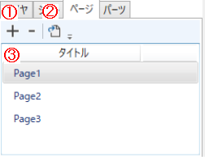

1. Add/Delete Page Buttons. You cannot delete a page if there is only one page.
1. Add Page from File button. Clicking this opens a file selection dialog, allowing you to add a page by selecting a file.
1. Page List. Displays a list of pages.

### Parts Tab
Frequently used shapes can be reused as parts. Parts are group shapes.  
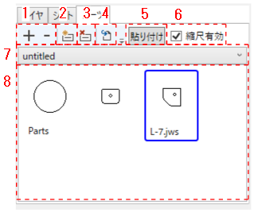

1. Add/Delete Parts button. To add a part, select the shape you want to make a part using the selection tool, and then press the Add Part button. It will be added as a part to the selected parts file. If the parts file does not yet exist, a file selection dialog will appear. Please create a file with an appropriate name.
2. Add Part File button. A file selection dialog will appear.
3. Delete Part File button. The file will be deleted from the list. The file itself is not deleted and remains on the disk.
4. Import Other Part Formats button. You can use JW_CAD part formats (JWS), etc.
5. Paste button. Pastes the selected part to the center of the screen.
6. Enable Scale checkbox. When checked, the object will be pasted at its actual size. If unchecked, it will be pasted at the size of the paper. It's best to uncheck symbols and other elements.
1. Switching Part Files. Clicking this allows you to switch between part files.
1. Part List. The selected part will have a blue border. Double-clicking a part will paste it to the center of the screen.

## Preview Panel
The entire editing screen is displayed. Selecting an area by dragging with the mouse will display that area on the editing screen.  
If 'Drawing' is checked, the drawing is displayed; if unchecked, the selected layer is displayed when the Document panel is in the Layers tab, and the selected sheet is displayed when it's in the Sheets tab.

## Status Bar
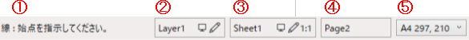

1. Information Display  
The name and operation description of the current tool are displayed. Errors during drawing editing are also displayed here.  
2. Layer Button  
The current layer is displayed. Changes can also be made from here.  
3. Sheet Button  
The current sheet is displayed. Changes can also be made from here.  
4. Page Button  
The current page can be displayed and changed from here.  
5. Paper Size Button  
The current paper size is displayed. Changes can also be made from here.

# Saving/Importing Files in Other Formats
PreCAD supports saving and importing files from other CAD software. 
However, compatibility for both saving and importing is not very high. <u>Even if you save an imported file in the same format, the resulting file will be completely different. Please be careful.</u>

## jw_cad
Conversion is difficult because the layer structure is quite different.  

- jwc format is only supported for import.  
    - Layer groups are converted to sheets.  
    - Only layers and layer groups that are in use are imported.
    - Line widths are not reflected. Line types are converted to the closest line type in PreCAD.
- jww format saving
    - Sheets are converted to layer groups.
    - Group shapes are converted to block shapes.
    - The font of text will be "MS Gothic".
    - Attributes of various shapes are not saved.
    - Color tables, etc., are reset. Colors other than solids are not saved.
    - Line widths are not reflected.
- jww format import
    - Layer groups are converted to sheets. 
    - Only layers and layer groups that are in use will be imported.
    - Block shapes will be converted to group shapes.
    - Font settings will not be reflected.
    - Line width will not be reflected. Line types will be converted to the closest line type in PreCAD.
    - Pasted images will not be imported.

## DXF

- DXF Save
    - Line width will not be reflected.
    - Line colors will be limited to the 16 basic colors.
    - MTEXT will be converted to multiple texts.
    - Group shapes and dimension shapes will be saved separately (they will not become blocks).
    - Sheet scale will not be reflected.
    - The number of characters in layers and unusable characters are not checked. There may be problems.
    - Only the minimum necessary information is written in the header, etc. There may be problems.

- DXF Import
    - Line width will not be reflected.
    - MTEXT formatting is partially supported.
    - Block shapes will be converted to group shapes.
    - Many elements are not supported. 
    - Font settings will not be reflected.
    - White color is not visible in PreCAD and will be converted to black.

# Drawing Tools  
Tools used for drawing and transforming shapes are divided into the following categories: "Line", "Circle", "Text", "Dimension", "Transform", "Copy", "Measure", and "Other". Please select from the "Tool Panel" or "Tool Menu".  
Also, tools will be added and improved sequentially, so the content may often differ from this manual. We plan to display tool descriptions in tooltips and status bar messages.  
When you select a tool, the following numerical input options will appear in the Tool Options panel.  
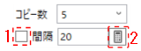  
Tools with a checkbox before the numerical input field, like in 1, will only be valid when checked.
Pressing the calculator icon in 2 will display a calculator, allowing you to input calculation results.  

## Line Category

### Line 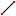

Draws a line by specifying two points. You can specify the line length and angle from the options.

#### Options  
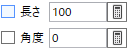  

- Length  
Checking this option allows you to specify the length.  
- Angle  
Checking this option allows you to specify the angle.

### Continuous Line 

Draw a line by specifying points consecutively. To finish, click the "Finish" button or double-click. Press the Esc key to return to the previous point.  
Checking "Polyline" creates a polyline, and you can specify the face color.

#### Options  
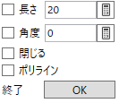

- Length  
Checking this option allows you to specify the length.  
- Angle  
Checking this option allows you to specify the angle.  
- Close  
Checking this option creates a closed shape with the start and end points closed.  
- Polyline  
Checking this option creates a polyline. You can specify the face color for polylines.  
- Finish  
Finishes drawing.  

### Rectangle   

Draws a rectangle. If the "Center" option is not checked, specify two vertices. If "Center" is checked, specify the center and a vertex.

#### Options  
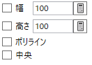

- Width  
Checking this option allows you to specify the width of the rectangle.  
- Height  
Checking this option allows you to specify the height of the rectangle.
- Polyline  
Checking this option creates a polyline. You can specify the face color for polylines.
- Center  
Checking this option draws the rectangle by specifying the center point and endpoints.

### Polygon 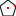

Draws a regular polygon.  

#### Options

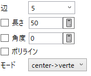

- Side  
Number of sides of the polygon
- Length  
Enables when checked. Means as follows depending on the mode:
    - Center->Vertex  
    Distance from the center to the vertex
    - Center->Edge  
    Distance from the center to the edge
    - Base  
    Length of the base
- Angle  
Enables when checked. Means as follows depending on the mode:  
    - Center->Vertex
    Angle from the center to the vertex
    - Center->Edge
    Angle from the center to the edge
    - Base
    Angle of the base
- Polyline  
Checks to create a polyline. You can specify the face color for polylines.
- Mode  
    There are three modes: Center->Vertex, Center->Edge, and Base.

### Double Line 

Draws two parallel lines. Pressing the Ctrl key allows you to specify a starting point with the same X or Y coordinate.

#### Options

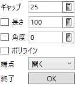

- Gap  
The distance between lines
- Length  
Checking this allows you to specify the length.
- Angle  
Checking this allows you to specify the angle.
- Polyline  
Checking this creates a polyline.
- Endpoint Type  
Specifies the treatment of the line ends.
    - Open: The ends are not connected.  
    - Closed: Two closed lines are created with the start and end points connected.
    - Closed End: One closed line is created with the start and end points connected.
- Exit
Ends drawing.

### Freehand 

Draws lines by tracing the mouse movement. The lines are polylines.

#### Options

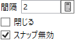

- Interval  
A point is added to the polyline when the mouse movement distance exceeds this value. Reducing this value will increase the data size, so please do not make it too small.
- Close  
Closes the start and end points.
- Disable Snap  
Check this if snapping interferes with drawing.

### Spline 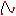

Draws a cardinal spline.

#### Options

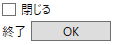

- Close  
Checking this will create a closed shape with the start and end points closed.
- Exit  
Ends drawing.

### Perpendicular Line 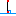

Draws a line perpendicular to the selected line/circle.

1. Select a line or circle
1. Specify the start and end points

#### Options

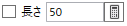

- Length  
Check this box to specify the length.

### Parallel Line 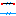

Draws a line parallel to the selected line.

1. Select a line
2. Specify the distance from the selected line
3. Specify the start and end points

#### Options

- Length  
Check this box to specify the length.

### Middle Line 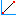

Draws a line midway between the two selected lines.

1. Select two lines
2. Specify the start and end points

#### Options

- Length  
Check this box to specify the length.

### Tangent Line 

Draws a tangent line to a circle.

1. Select a circle
2. Specify the start and end points

#### Options

- Length  
Check this box to specify the length.
- Angle  
Check this box to specify the angle.

### Line Tangent to Two Circles 

Draws a line tangent to two circles. The tangent lines are drawn from the vicinity of the selected points on each circle.

### Circle Centerline 

Draws the centerline of the selected circle.

1. Select the circle
2. Specify the length of the centerline

#### Options

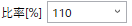

- Ratio [%]  
Checking this box allows you to specify the length of the centerline as a ratio to the diameter.

### Break Line 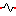

Draws a break line.

#### Options

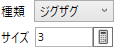

- Type  
The type of break line. Zigzag, wavy, and S are available.
- Size  
Consider this as a guideline.

## Circle Category

### Circle 

Draws a circle by specifying the center and radius.

#### Options
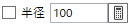

- Radius  
Checking this box allows you to specify the radius.

### 3-Point Circle 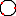

Draws a circle passing through three points.

#### Options

- Radius  
Checking this box allows you to specify the radius. The third point determines the direction of the circle.

### Ellipse 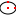

Draws an ellipse by specifying the center, radius, flattening ratio, and angle.

#### Options
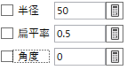

- Radius  
Checking this box allows you to specify the radius.
- Flatness  
Checking this box allows you to specify the aspect ratio.
- Angle  
Checking this box allows you to specify the ellipse's inclination.

### Ellipse (2 points) 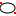

Draws an ellipse by specifying two points.

#### Options
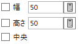

- Width  
Checking this box allows you to specify the width.
- Height  
Checking this box allows you to specify the height.
- Center  
Checking this box specifies the center and vertices.

### Circle Tangent to a Line 

Draws a circle tangent to a line or circle.

1. Select a line or circle
2. Specify the center point

#### Options

- Radius  
Checking this box allows you to specify the radius.

### Two-Line Tangent Circle 

Draws a circle tangent to two lines or circles.

1. Select two lines or circles
2. Specify a passing point

#### Options

- Radius  
Checking this box allows you to specify the radius.

### Three-Line Tangent Circle 

Draws a circle tangent to three lines or circles.

1. Select three lines or circles. If all are lines, the circle will be drawn here.
2. Select the desired circle from multiple drawable circles.

### Ellipse Tangent to Two Lines 

Draws an ellipse tangent to two lines forming a parallelogram.

### Arc 

Draws an arc by specifying the center, radius, starting angle, and angle width.

#### Options
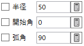

- Radius  
Check this to specify the radius.
- Starting Angle  
Check this to specify the starting angle.
- Angular Width  
Check this to specify the angle width.

### Three-Point Arc 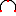

Draws an arc by specifying the start point, end point, and passing points.

#### Options

- Radius
Checking this box allows you to specify the radius.

### Semicircle 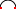

Draws a semicircle by specifying the start point, end point, and direction.

#### Options
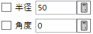

- Radius  
Checking this box allows you to specify the radius.
- Angle  
Checking this box allows you to specify the slope of the semicircle.

### Quartercircle 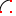

Draws a semicircle by specifying the center, end point, and direction.

#### Options

- Radius  
Checking this box allows you to specify the radius.
- Angle  
Checking this box allows you to specify the angle of the semicircle.

## Text Category

### Text 

Draws a single line of text.  
The background color of the text can be specified using the "Face" color of the style.  
Due to font issues, the font and size of the text may vary depending on the device. Please position the text with sufficient margin.

#### Options
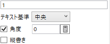

- Text Input Area  
- Text Reference Point  
Reference point for placing text
- Angle  
- Vertical Writing  
Checking this box enables vertical writing.

### Multi-Line Text 

Draws multiple lines of text.  
The background color of the text can be specified using the "Face" color of the style.  
Due to font issues, the font and size of the text may vary depending on the device. Please position the text with sufficient margin.

#### Options
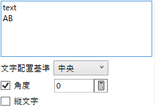

- Text Input Area
- Text Alignment Reference Point  
The reference point for aligning text. You can set the center, bottom left, etc.
- Angle
- Vertical Text  
Checking this will enable vertical writing.

### Leader Line 

Draws a leader line.

#### Options
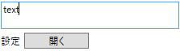

- Text Input Area
- Settings  
Opens the leader line settings dialog.

### Balloon 

Draws a balloon.

#### Options

- Text Input Area
- Settings  
Opens the leader line settings dialog.

## Dimension Category

### Dimension 

Draws a dimension shape.

#### Options
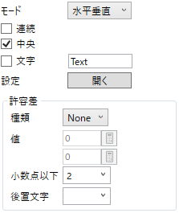

- Mode
    - Normal: No constraints
    - Horizontal: Dimension line constrained horizontally
    - Vertical: Dimension line constrained vertically
    - Horizontal/Vertical: Dimension line constrained horizontally and vertically
- Continuous  
When checked, the dimension line is drawn continuously from the previous point. Press the Esc key to exit.
- Center  
When checked, the dimension value is drawn at the center of the dimension line.
- Text  
When checked, arbitrary text is drawn on the dimension line.
- Settings  
Opens the dimension line settings dialog.
- Tolerance  
    - Type: How to display the tolerance value (None: No display; One line: One line (±);  Two lines: Two lines)  
    -  Value: Tolerance value  
    -  Decimal places: Number of decimal places  
    -  Suffix: Characters to add after the tolerance value  

### Diameter 

Draws the diameter dimension of a circle.

1. Select the circle
2. Specify the angle of the dimension shape and the position of the text

#### Options
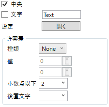

- Center  
Checking this option draws the dimension value at the center of the dimension line.
- Text  
Checking this option draws arbitrary text on the dimension line.
- Settings  
Opens the dimension line settings dialog.
- Tolerance
    - Type: How the tolerance value is displayed (None: No display; One line: One line (±); Two lines: Two lines)
    - Value: Tolerance value
    - Decimal places: Number of decimal places
    - Suffix: Character to add after the tolerance value

### Radius 

Draws the radius dimension of a circle.

1. Select the circle
2. Specify the angle of the dimension shape and the text position

#### Options

- Center  
Checking this option draws the dimension value at the center of the dimension line.
- Text  
Checking this option draws arbitrary text on the dimension line.
- Settings  
Opens the dimension line settings dialog.
- Tolerance  
    - Type: Display method of tolerance value (None: No display; One line: One line (±); Two lines: Two lines)
    - Value: Tolerance value
    - Decimal places: Number of decimal places
    - Suffix: Character to add after the tolerance value

### Angle 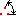

Draws an angle shape by specifying the center, two leader points, and text position.

#### Options

- Center  
Checking this option draws the dimension value at the center of the dimension line.
- Text  
Checking this option draws arbitrary text on the dimension line.
- Settings  
Opens the dimension line settings dialog.
- Tolerance  
    - Type: How to display the tolerance value (None: No display; One line: One line (±); Two lines: Two lines)
    - Value: Tolerance value
    - Decimal places: Number of decimal places
    - Suffix: Character to add after the tolerance value

### Angle between two lines 

Draws the angle between two lines.

1. Select two lines
2. Specify the text position

#### Options

- Center  
Checking this option draws the dimension value at the center of the dimension line.
- Text  
Checking this option draws arbitrary text on the dimension line.
- Settings  
Opens the dimension line settings dialog.
- Tolerance  
    - Type: How to display the tolerance value (None: No display; One line: One line (±); Two lines: Two lines)
    - Value: Tolerance value
    - Decimal places: Number of decimal places
    - Suffix: Character to add after the tolerance value

### Line Dimensions 

Draws the length of the selected line and the diameter of the circle.

1. Select the line/circle
2. Specify the text position

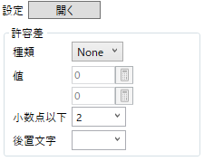

- Settings  
Opens the dimension line settings dialog.
- Tolerance  
    - Type: How the tolerance value is displayed (None: No display; One line: One line (±); Two lines: Two lines)
    - Value: Tolerance value
    - Decimal places: Number of decimal places
    - Suffix: Characters to add after the tolerance value

### Dimension Line Skew 

Skews the dimension line. After selecting the dimension line, specify the angle to skew. You can also choose whether to skew the text. Can be used to create dimensions in isometric drawings.

#### Options

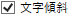

- Text Skew  
When checked, the text will be skewed along with the dimension line.

## Transformation Category

### Corner 

Select two lines or arcs to connect them and create a corner.

### Chamfer 

Two-line chamfer

1. Select two lines
2. Specify the chamfer size

#### Options

- Length  
Checking this allows you to specify the chamfer size.

### Round Corner 

Select two lines or arcs to connect them and round the corner.

1. Select two lines
2. Specify the radius for rounding the corners

#### Options

- Radius  
Checking this box allows you to specify a radius.

### Line Extension 

First, select a line. Then, extend or shorten the selected line so that it is tangent to the first selected line.  
The first shape can be a line, circle, arc, or polyline. The second shape can be a line or arc.

### Line Deletion 

Deletes the selected line or circle up to the intersection point of another shape.

### Line Cutting 

Specify a rectangle at two points and delete the line between them.

### Trim 

Specify a rectangle with two points and cut or connect the endpoints and intersections of lines within it (envelope operation).

### Operation 

Perform an operation between two circles or a closed polyline. Operations include AND, OR, and SUB. Please select from the options. The result of the operation will be a closed polyline. Parts of circles, etc., will be divided into line segments.

### Stretch 

Specify a rectangle with two points and extend the endpoints of lines within it.

1. Specify the area including the endpoints with two points.
2. Specify the reference point.
3. Specify the extension point.

### Selection Tool 

- Select shapes and perform actions such as moving and transforming them. Grouping shapes and creating parts are also done with this tool.
- There are two ways to select shapes: by clicking directly on the shape, or by drawing a box around it with two points.
- When drawing a box with two points, drawing from left to right selects the entire shape within that box. Drawing from right to left selects only a portion of the shape within the box.
- Drag the selected shape to move it.
- Handles will appear on the selected shape; dragging these handles will resize it. If "Handle Movement" is checked, dragging the handles will move the shape.
- Holding down the Ctrl key while moving or resizing will leave a copy of the original shape.
- Holding down the Shift key while moving restricts the movement direction to vertical and horizontal. Resizing by dragging the handles locks the aspect ratio.

#### Options

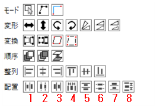

- Mode
    i. Move with Handle Drag  
    Normally, dragging the handles resizes the object, but when enabled, it moves without resizing.
    i. Vertex Editing Mode  
    Normally, handles are on the outline of the rectangular area of ​​the shape, but when enabled, handles are displayed on the vertices of polylines, etc. In this mode, you can edit the vertices of polylines.
    i. Continuous Line Selection Mode  
    When enabled, you can select all lines connected to the clicked line at once.

- Transform
    i. Flip Horizontally  
    Clicking flips the selected shape horizontally.
    i. Flip Vertically  
    Clicking flips the selected shape vertically.
    i. Rotate Left  
    Clicking rotates the selected shape 90 degrees to the left.
    i. Rotate Right  
    Clicking rotates the selected shape 90 degrees to the right.
    i. Rotate  
    Clicking this will display a rotation angle input dialog, allowing you to specify an angle for rotation.
    i. Move  
    Clicking this will display a move coordinate input dialog, allowing you to specify relative coordinates for movement.
    i. Resize  
    Clicking this will display a resize dialog, allowing you to specify a magnification for scaling.
    i. Shear  
    Performs shear deformation. Clicking this will display a dialog where you can select the type of shear.

- Change
    i. Group  
    Clicking this will convert the selected shapes into a group shape.
    i. Ungroup  
    Clicking this will ungroup the selected group shapes.
    i. Convert to Polyline  
    Clicking this will convert the selected shapes into a polyline.
    i. Decompose into Line Segments  
    Clicking this will decompose the selected shapes into line segments.

- Order
    i. Top Layer  
    Clicking this will move the stacking order of the selected shapes to the top layer.
    i. Bottom Layer  
    Clicking this will move the stacking order of the selected shapes to the bottom layer.
    i. Change Layer  
    Clicking this will display the Change Layer dialog box, moving the selected shapes to another layer.

- Align  
Aligns the selected shapes.

- Distribute  
Distributes the selected shapes evenly.

## Copy Category

### Offset 

Offsets lines and circles.

#### Options

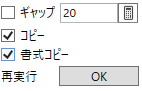

- Gap  
Specifies the offset interval.
- Copy  
Checking this option preserves the original shape.
- Copy Formatting  
Checking this option uses the line color of the original shape. If unchecked, the current line color, etc., are used.
- Re-execute  
The offset is executed at the interval from the previous execution.

### Line Copy 

Copies the selected shape along a straight line.

1. Select the shape and right-click to finish the selection. The reference point is the point where you right-clicked.
1. Specify the End Point of the Copy

#### Options

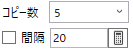

- Number of Copies
- Interval  
You can specify the interval for copying.

### Circle Copy 

Copies the selected shape in a circle.

1. Select the shape and finish the selection by right-clicking. The reference point is the point where you right-clicked.
2. Specify the center point of the shape to be copied.

#### Options

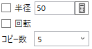

- Radius  
You can specify the radius for the circle copy numerically.
- Rotation  
Checking this will rotate the shape.
- Number of Copies  

### Array Copy 

Copies the selected shape vertically and horizontally.

1. Select the shape and right-click to finish the selection. The reference point is the point where you right-clicked.
2. Specify the end point of the copy.

#### Options

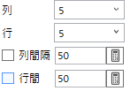

- Column  
Number of copies in the column direction
- Row  
Number of copies in the row direction
- Column Spacing  
You can specify the spacing of the columns to copy.
- Row Spacing  
You can specify the spacing of the rows to copy.

### Rotation 

Rotates the shape.

1. Select the shape and right-click to finish the selection. The reference point is the point where you right-clicked.
2. Specify the center point of the shape
3. Specify the rotation angle

#### Options

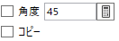

- Angle  
Checking this box allows you to specify the angle.
- Copy  
Checking this option will keep the original shape.

### Baseline Copy 

Performs horizontal flip and tilt correction.

1. Select the shape and right-click to finish the selection.
2. Specify the start and end points of the baseline.

#### Options
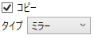

- Copy  
Checking this option will keep the original shape.
- Type  
    - Mirror: Flips horizontally relative to the baseline.  
    - Horizontal: Rotates the baseline to be horizontal. Used for tilt correction.
    - Vertical: Rotates the baseline to be vertical. Used for tilt correction.

### Intersection Copy 

Places the copied shape at the intersection of the shapes.

1. Select the shapes and right-click to finish the selection. The reference point is the point where you right-clicked.
2. Select the shapes where you want to find the intersection. Right-click to finish the selection, and the copy will be executed.

### Equally Spacing Copy 

Duplicates shapes at equal intervals between them. Lines, circles, and arcs are targeted.

If the target shape is a line, you can choose from the options to divide the interval equally or divide the angle equally.

1. Select two shapes to copy. The second shape selected must be the same as the first shape.

## Measurement Categories

### Measurement (Line) 

Measures the distance and angle between two points.

### Measurement (Area) 

Measures the area and length of a region enclosed by multiple points.

### Measurement (Shape) 

Measures the area and length of a shape.

## Other Categories

### Point 

Places a point.

#### Options

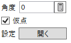

- Angle  
Point inclination
- Temporary Point  
Checking this option uses a guide line type (not printed).
- Settings  
Opens the settings dialog. You can choose the type and size of the point. The "dot" type of point will be displayed at the same size regardless of the screen zoom level (size cannot be specified).

### Divide Point 

Places points that divide lines or circles into equal parts.

#### Options

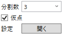

- Number of Divisions
- Temporary Points  
Checking this option uses auxiliary line types (they are not printed).
- Settings  
Opens the settings dialog. You can choose the type and size of the points. The "dot" type of point will be displayed at the same size regardless of the screen zoom level (size cannot be specified).

### Hatching 

Creates hatching. Hatching becomes a group shape.

1. Select the hatching area. The hatching area does not need to be closed, but often fails if it is not.
2. Right-click to perform hatching. The point where you press the right button becomes the hatching reference point.

#### Options

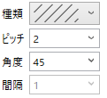

- Type  
Select the hatching type.
- Pitch  
Hatching pitch
- Angle  
Hatching angle
- Spacing  
Spacing between lines for 2- or 3-line hatching styles

### Coordinate File 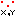

This tool draws a shape with the cursor position as the origin, connecting the coordinates in a loaded coordinate file.  
The coordinate file consists of XY coordinates separated by spaces on each line. 
For details, please refer to the sample file which can be loaded from the options.

### Script 

Allows you to load and use Jw_cad line symbol files.

#### Options

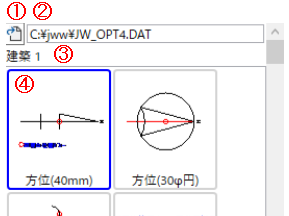

1. Open File Button  
Clicking this button displays the file open dialog.
2. The opened file name is displayed.
3. Title
4. When a file is opened, an icon is displayed; selecting it executes its function.

### Milling G-Code (Experimental) 

This creates G-code for planar milling on a desktop CNC milling machine. Currently, there is no opportunity to test it on a real machine, so it is only being tested on a simulator.