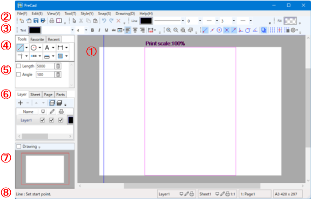
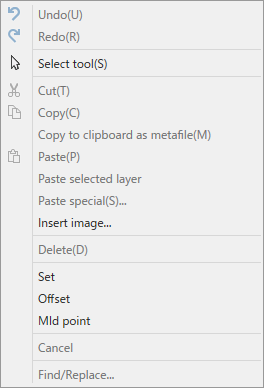
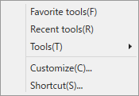
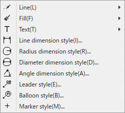
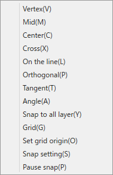
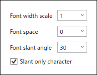
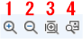
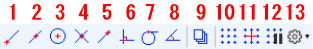

---
html:
   embed_local_images: true
   embed_svg: true
   offline: true
   toc: true
print_background: false
title: PreCad Manual
---

# PreCAD (Windows) Manual
## Window structure

### 1.Edit panel
#### Mouse operation
Use the mouse to draw figures with [DrawTools](#DrawTools). Mouse operations used for drawing are as follows.
- left click
   Specifies the coordinates at the clicked position. Depending on the tool, you can constrain the direction of movement vertically and horizontally by clicking while holding down the Shift key.
- left double click
   Depending on the tool, it is used to end operations, etc.
- right click
   The context menu. Assigned to the end of entity selection depending on the tool.
- left button drag
   Some tools are used to select figures within a range.
   With the selection tool, dragging from left to right selects all entities within the range, and dragging from right to left selects entities that are partially within the range.
- mouse wheel
   - Scale with rotation.
   - Drag to scroll.
   - Hold down the Shift key and drag to enlarge the area.
   - Shift key and click to move the position to the center of the screen.

#### Cursor

- The cursor will display two coordinate values. The top is relative coordinates from the grid origin, and the bottom is relative coordinates from the anchor. The anchor is the last clicked point or the coordinates determined by the tool. For example, with the arc tool, the center of the circle is the anchor.
- Coordinate values can be turned on and off from the menu.
- The cursor is blue when normal, but turns red when snapped. When snapping, a mark indicating the type is displayed on the upper left of the cursor. See [Snap Toolbar](#SnapToolBar) for the marks that are displayed.
- There are two types of cursors: a cross cursor and a full screen cross cursor that draws a line to the edge of the screen. Switching is done from the [View Menu](#ViewMenu).

### 2. Menu

You can execute commands from the top menu. The same commands in the menu (but not all) are also found in the toolbar.

#### File

1. New
There are New file and New file from template.
Creating a new file from a template creates a new file based on a previously created file.
2. Open
A file open dialog opens.
3. Save
Save the file. If you do not have a file name yet, a file save dialog will open where you can enter a file name.
4. Save as
A file save dialog opens.
5.Print
A print dialog opens.
6. Set print area
Switches to the print area setting tool. The cursor position becomes the center of the print area. The following options appear in the tool panel:

    1. Adjust the print area to fit the paper and change the magnification.
    2. Move the print area to the center.
    3. Print magnification.
    4. Exit the print area setting tool and return to the previous tool.
7. Settings
Configure various settings.

    1. New file setting
    Set the default paper and scale here when creating a new file.
    2. Reset toolbar
    Reset toolbar placement. The toolbar will be reset after restart.
2. Opened recent
Recently opened files are displayed and can be selected.
3. End
Exit this app.

#### Edit

1. Undo
Undo the previous operation.
2. Redo
Redo the undone operation.
3. Select tool
This is a tool that selects shapes and moves and transforms them ([See selection tool](#SelectTool)). You can do a lot of things.
2. Cut
Cuts the shape selected with the selection tool and copies it to the clipboard.
3. Copy
Copies the shape selected with the selection tool to the clipboard.
1. Copy to clipboard as metafile
Copies the shape selected with the selection tool as a metafile.
2. Paste
Paste shapes from the clipboard. The pasted shape will appear in the center of the editing screen.
2. Paste selected layer
Normal pasting pastes to the source layer, but this pastes to the currently selected layer.
1. Paste special
Select various formats (such as PNG) from the dialog and paste.
1. Insert image
Select the image file and paste it.
1. Delete
Deletes the shape selected with the selection tool.
2. Cancel
Cancels the operation being edited (same as ESC key).
3. Find/Replace
You can search and replace strings.

#### View

1. Zoom
The submenus include Zoom in, Zoom out, and Fit to paper.
2. Status bar
Show/hide the status bar at the bottom of the screen.
3. Print area
Show/hide the print area.
4. Coordinate values
Show/hide cursor coordinate values.
5. Black background
Switching the background color between white and black. If the background color is black, the line color will switch between white and black.
6. Full screen cross cursor
Switch between a cross cursor and a full screen cross cursor that draws a line to the edge of the screen.
7. Option
The option settings dialog will be displayed.

    1. Marker (dot) radius
Specify the dot radius for the marker type here.
    1. Auxiliary line color
    You can change the color of the extension line here. Please note that if you use a color that is close to the background color, it will be difficult to see.
    2. Dashed line scale
    You can change the pitch of the dashed line. Please enter a value between 0.5 and 2.0.
    3. Font
    Specify here whether to use an alternative font when a font that is not installed on your computer is used.
    Normally, you don't have to specify it because Windows will process it appropriately, but in Wine, if you do not specify it, garbled characters may occur.
    4. Background
    You can paste an image on the background of the editing screen. Enable it and choose your favorite image.
    Lowering the opacity allows you to see the image clearly through the paper.
    5. Polylining
    Here you can set the criteria for dividing circles (including arcs) and spline (Bezier) curves into lines.
    The number of divisions of a circle has a precision and a maximum number of divisions. A precision of 0 will always divide by the maximum number of divisions. Enter a value of 1/4 for the maximum number of divisions of the circle (the circle will actually be 4 times this value).
    These values are also used to detect intersections when hatching, so making them too rough will affect the calculation results.
    Also, setting a finer value will affect the amount of data and processing time after conversion, so please set an appropriate value.

#### Tool

You can select [DrawTools](#DrawTools) from here.

#### Style

You can set the style of the shape from here. The same items are also available in the toolbar, so please refer to the toolbar for details.

#### Snap

Snap settings (see [Snap Toolbar](#SnapToolBar)).

#### Drawing

You can set layers, sheets, and pages, but I think the [Document Panel] (#DocumentPanel) and [Status Bar] (#StatusBar) are easier to use.

#### Help

1. Manual
The manual will open.
2. About PreCad
PreCad information will be displayed.
3. Send feedback
If you have any questions for the author, please ask them here. A mailer will open with the author's contact information in the recipient and the app name and version in the subject, so please write the text.
4. Plugin information
Many of PreCad's features are made up of plugins. That information will be displayed.

### 3. Toolbar

#### File Toolbar

1. New
2. Open
3. Overwrite save
4. Save file as
5. Print
  A print dialog appears. You can print by selecting the printer, paper, etc. and pressing the print button.
6. Print area setting
  Determines the area that will be printed on the current printer's paper.

#### Edit Toolbar

1. Selection tool
A tool that selects a shape and moves and transforms it. You can do many things.
2. Cut
Cuts the shape selected with the selection tool and copies it to the clipboard.
3. Copy
Copies the shape selected with the selection tool to the clipboard.
4. Paste
Paste a shape from the clipboard. The pasted figure appears in the center of the editing screen.
5. Undo
Undoes an editing operation.
6. Redo
Redo an operation that was undone.
7. Cancel
Cancels the editing operation (same as ESC key).

#### Line Style Toolbar

1. Line color
   Select a line color. [L] uses [Layer Color](#LayerStyle).
1. Line type
   Select a linetype. L uses [Layer Line Style](#LayerStyle). [A] is a non-printing line (construction line).
1. Line width
   Choose a line width. [L] uses [Layer line width](#LayerStyle).
1. Start point arrow type
1. Start arrow size
1. End point arrow type
1. End arrow size

#### Face Style Toolbar

1. Face color
   Select a face color. [L] uses [Layer Color](#LayerStyle).

#### Character Style Toolbar

1. Text color
   Select a font color. [L] uses [Layer Color](#LayerStyle).
1. Font name
1. Font size
   The unit is mm.
4. Bold
5. Italics
6. Underlining
7. Strikeout
8. Settings
A settings window will open where you can configure other font settings.

    1. Font width scale
    Character width expansion rate.
    2. Font space
    Space between letters.
    3. Font slant angle
    The slant angle of the characters. The direction tilting to the right is positive.
    4. Slant only character
    If checked, each character will be slanted and the background frame will not be slanted. In the figure below, 1 is unchecked and 2 is checked.
   
9. Align Left
10. Central
11. Right justification
12. Setting dimension line, etc.
From here you can set dimension line, leader, marker, etc.

#### Zoom Toolbar

1. Expand
1. Shrink
1. View the entire sheet.

#### Snap Toolbar

If checked, the cursor position is fixed when approaching the end point of the figure.
1. Endpoint
   Line endpoints, polygon vertices, etc. A "V" appears on the cursor when snapping.
1. Midpoint
   Midpoint of a line, 1/4 point of a circle, etc. When snapping, an "M" appears on the cursor.
1. center
   such as the center of a circle. A "C" appears on the cursor when snapped.
1. intersection
   The intersection of lines on the same layer. An "X" appears on the cursor.
1. on the line
   Snap on line. "L" is displayed on the cursor.
1. Orthogonal
   A point perpendicular to a line or circle. A "P" appears on the cursor.
1. Contact
   A point tangent to a circle. A "T" appears on the cursor.
1. Angle
   The cursor position is constrained for each angle. "A" and the angle are displayed on the snap cursor.
1. Grid
   A grid appears and snaps when the cursor is close to it. "G" is displayed on the snap cursor.
1. Grid origin setting
   The grid origin specification mode is entered. Click the mouse at the position where you want to specify the origin on the editing screen.
1. Snap settings
   The Snap Settings dialog will open. You can set the number of grid divisions and angle snap angle.

1. Grid size
grid spacing.
2. Number of grid divisions
Number of subgrid divisions.
3. Grid angle
You can give the grid a tilt angle.
4. Scale effective
If checked, the grid spacing will be a real number.
5.Type
Grid type. You can choose straight line or +.
5. Snap angle
Set the angle of the angle snap here.

### 4. Tools panel
Select [Draw Tools](#DrawTools) from here. The tools are divided into categories. The categories are "Line", "Circle", "Text", "Dimension", "Transform", "Copy", "Measure", and "Other".
If you press the displayed icon, the tool of that icon will be selected. Press the triangle button next to the icon to display the list of tools included in the category.

### 5. Tool Options Panel
This panel is for entering numerical values such as the length and angle that can be set with the [Drawing Tools](#DrawTools).

### 6. Document Panel
There are tabs for Layers, Sheets, Pages and Parts.
#### Layer Tab
Here you can set the layers and select the layers to write.

1. Layer Add/Delete button. When there is only one layer, it cannot be deleted.
2. Layer order button. Swap the order of the selected layers. You can also change the order by dragging the layer name part in the layer list.
3. Layer display button. From left: all layers visible, non-selected gray, only selected layers visible
4. Menu button. The following menu will be displayed.
   - [Turn ON/OFF all visible flags] Turn ON/OFF all visible flags on the list.
   - [Turn all editable flags ON/OFF] Turn ON/OFF all editable flags on the list.
   - [Turn ON/OFF all printable flags] Turn ON/OFF the printable flags on the list all at once.
   - [Layer settings] Displays a dialog for setting the name of the layer, etc. (The items that can be set in this dialog can be edited directly from the layer list, so you may not need to use them.)
5. Layer list. A list of layers appears. Layers that go down in the layer list are displayed on top of each other on the screen.
6. Layer name. Double click or F2 key to edit. End editing is decided by Enter key, cancel by Esc key. You cannot enter an anonymous name or the same name as another layer.
7. Layer display / non-display switching. Layers that are selected but hidden are visible. Hidden layers are also not printed.
8. Editable/non-editable toggle.
9. Printable/non-printable switch.

10. Layer style. Click to specify layer color, line type, and line thickness.
   - line color
     This is the line color used when the line color of the figure is set to L (ByLayer).
   - Line type
     This is the line type used when the line type of the figure is set to L (ByLayer).
   - line width
     This is the line width used when the line width of the figure is set to L (ByLayer).

#### sheet tabs
Here you can set the sheet and select the sheet to use for writing.

1. Add sheet, delete button. If there is only one sheet, it cannot be deleted.
2. Sheet view button. From the left, all sheets are visible, other than selected sheets are gray, and only selected sheets are displayed.
3. Menu button. The following menu will be displayed.
   - [Turn ON/OFF all visible flags] Turn ON/OFF all visible flags on the list.
   - [Turn all editable flags ON/OFF] Turn ON/OFF all editable flags on the list.
   - [Turn ON/OFF all printable flags] Turn ON/OFF the printable flags on the list all at once.
   - [Sheet Settings] Displays a dialog for setting the name of the sheet, etc. (The items that can be set in this dialog can be edited directly from the sheet list, so you may not need to use them.)
4. Seat list. A list of sheets is displayed.
5. Sheet name. Double click or F2 key to edit. End editing is decided by Enter key, cancel by Esc key. You cannot enter an anonymous name or the same name as another sheet.
6. Sheet display / non-display switching. Sheets that are selected even if they are hidden are displayed. Hidden sheets are also not printed.
7.Editable/non-editable toggle.
8. Printable/non-printable switch.
9. Scale button. Click to display the scale setting dialog.

#### page tabs
Page settings and selection of pages to be written are performed here.

1. Add page, delete button. If there is only one page, it cannot be deleted.
2. Add page from file button. Click to open a file selection dialog, and select a file to add a page.
3. Page list. A list of pages is displayed.

#### Parts tab
Shapes that are frequently used can be reused as parts. Parts are group entities.

1. Add/delete parts button. To add parts, select the shape you want to use as a part with the selection tool and press the Add Parts button. It will be added as a part to the selected parts file. If the part file does not yet exist, a file selection dialog will appear. Create a file with an appropriate name.
2. Add part file button. A file selection dialog is displayed.
3. Part file delete button. The file is removed from the list. The file itself is not deleted and remains on the disk.
4. Other format parts import button. Parts format (jws) of jw_cad can be used.
5. Paste button. Paste the selected part to the center of the screen.
6. Scale Enabled checkbox. If checked, it will be pasted at the actual size. If the check is removed, it will be the size on the paper. Symbols should be unchecked.
7. Part file switching. Click to switch part files.
8. Parts list. A blue frame is displayed for the selected part. Double-click the part to paste it in the center of the screen.

### 7. Preview panel
The entire editing screen is displayed. If you select it with the mouse drag, the range will be displayed on the edit screen.
If [Drawing] is checked, the drawing will be displayed. If the document panel is not checked, the selected layer will be displayed when the layer tab is selected, and the selected sheet will be displayed when the document panel is set to the sheet tab.

### 8. Status Bar

1. Information display
   The name of the current tool and operation instructions are displayed. Errors during geometry editing are also displayed here.
2. Layer button
   Shows the current layer. You can also make changes from here.
3. Seat button
   Displays the current sheet. You can also make changes from here.
4. Page button
   You can view and change the current page from here.
5. Paper size button
   Displays the current paper size. You can also make changes from here.

## Saving/loading other formats

PreCAD supports saving and loading other CAD files.

However, both saving and loading are not very compatible. <u>Even if you save the read file in the same format, the contents will be completely different. be careful. </u>

### jw_cad

Conversion is difficult because the layer structure is quite different.

- The jwc format supports reading only.
   - Layer groups are converted to sheets.
   - Only used layers and layer groups are loaded.
   - Line width is not reflected. Linetypes are converted to the closest linetype in PreCAD.
- jww format save
   - Sheets are converted to layer groups.
   - Group entities are converted to block entities.
   - The character font will be "MS Gothic".
   - Attributes of various shapes are not saved.
   - The color table etc. will be reset. Colors are not saved except for solids.
   - Line width is not reflected.
- read jww format
   - Layer groups are converted to sheets.
   - Only used layers and layer groups are loaded.
   - Block shapes are converted to group shapes.
   - Character font is not reflected.
   - Line width is not reflected. Linetypes are converted to the closest linetype in PreCAD.
   - Pasted images are not loaded.

### DXF

- Save DXF
   - Line width is not reflected.
   - There are 16 basic line colors.
   - MTEXT will be multiple TEXTs.
   - Group entities and dimension entities are saved exploded (not block).
   - Sheet scale is not reflected.
   - It does not check the number of characters in the layer, disabled characters, etc. there may be a problem.
   - Only the minimum necessary information is written in the header etc. there may be a problem.

- DXF import
   - Line width is not reflected.
   - Some MTEXT formats are supported.
   - Block shapes are converted to group shapes.
   - Many elements are not supported.
   - Character font is not reflected.
   - When importing, white color is not visible in PreCAD and is converted to black color.

## Drawing tools

The tools used for drawing and transforming figures are divided into the categories of "Line", "Circle", "Text", "Dimension", "Transform", "Copy", "Measure", and "Other". Select from the "Tools Panel" or "Tools Menu".

In addition, since tools are added and improved one by one, the contents of this manual may differ from those of this manual. I'm thinking of displaying tool descriptions in tooltips and status bar messages.
When you select a tool, the following options for numeric input appear in the Tool Options panel.

If there is a check box in front of the numerical input field like 1, the numerical value will be valid when it is checked.
If you press the calculator icon of 2, the calculator will be displayed and you can enter the calculation result.
### Line Category

#### Line 

Draw a line by specifying two points. You can specify the length and angle of the line from the options.

##### options

- length
   If checked, the length can be specified.
- angle
   If checked, the angle can be specified.

#### Polyline 

Draw a line by specifying a series of points. To finish, click the "Exit" button or double-click. Press the Esc key to return to the previous point.
If you check Polyline, it becomes a polyline and you can specify the color of the face.

##### options

- length
   If checked, the length can be specified.
- angle
   If checked, the angle can be specified.
- close
   If checked, the shape will be closed at the start and end points.
- polyline
   If checked, it becomes a polyline. Polylines can specify face colors.
- end
   Finish drawing.

#### Rectangle 

Draw a rectangle. If the center option is not checked, specify two vertices. If the center is checked, specify the center and vertex.

##### options

  

  - width
   If checked, the width of the rectangle can be specified.
- height
   If checked, the height of the rectangle can be specified.
- polyline
   If checked, it becomes a polyline. Polylines can specify face colors.
- Center
   When checked, draws by specifying the center point and end points.

#### Polygon 

Draw a regular polygon.

##### options
  

- side
   number of sides of polygon
- length
   Check to enable. The mode has the following meanings.
   - Center -> Vertex
     Distance from center to vertex
   - center -> edge
     distance from center to edge
   - bottom
     base length
- Angle: Check to enable. Depending on the mode,
   - Center -> Vertex
   center to vertex angle
   - center -> edge
   side angle from center
   - bottom
   base angle
- polyline
   If checked, it becomes a polyline. Polylines can specify face colors.
- mode
There are three modes: Center->Vertex, Center->Edge, and Base.

#### double line 
Draw two parallel lines. If you press the Ctrl key, you can specify a position that has the same X or Y coordinate as the start point.

##### options

  

- Gap
   Spacing between lines
- length
   If checked, the length can be specified.
- angle
   If checked, the angle can be specified.
- polyline
   If checked, it becomes a polyline.
- endpoint type
   Specifies the treatment of line ends.
   - Open: Both ends are not connected
   - Closed: It will be two closed lines with connected start and end points.
   - End Closed: A closed line that connects the start point and the end point.
- end
   Finish drawing.

#### Freehand 
Draw a line by following the movement of the mouse. A line is a polyline.

##### options

  

- interval
   Add a point to the polyline when the mouse moves more than this value. Decreasing this value increases the amount of data, so do not decrease it too much.
- close
   Close the start and end points.
- disable snap
   Check if snapping interferes with drawing.

#### Spline 
Draw a cardinal spline.

##### options

  

- close
   If checked, the shape will be closed at the start and end points.
- end
   Finish drawing.

#### Orthogonal line 
Draw a line perpendicular to the selected line/circle.
1. Select line or circle
2. Specify start and end points
##### options

  

- length
   If checked, the length can be specified.

#### Parallel line 
Draw a line parallel to the selected line.
1. Select line
2. Specify distance from selected line
3. Specify start and end points
##### options

  

- length
   If checked, the length can be specified.

#### middle line 

Draw a line between the two selected lines.

1. Select two lines
2. Specify start and end points

##### options

  

- length
   If checked, the length can be specified.

#### Tangent line 
Draw a tangent to the circle.
1. Select a circle
2. Specify start and end points
##### options

- length
   If checked, the length can be specified.
- angle
   If checked, the angle can be specified.

#### Circle and line tangent to circle 
Draw a circle and a line tangent to the circle. A tangent is drawn from the vicinity of the selected point on each circle.

#### Circle center line 
Draw the center line of the selected circle.
1. Select a circle
2. Specify the length of the centerline
##### options

- Ratio [%]
   If checked, the length of the center line can be specified as a ratio of the diameter.

#### Breakline 

Draw a break line.

##### options

- kinds
   Type of break line. Zigzag, wavy lines, and S can be selected.
- size
   Please think about it as a guideline.

### Circle Category

#### Circle 
Draw a circle by specifying the center and radius.
##### options

- Radius
   If checked, the radius can be specified.

#### 3 point circle 
Draw a circle that passes through the 3 points.
##### options

- Radius
   If checked, the radius can be specified. The third point is the direction of the circle.

#### Ellipse 
Draw an ellipse by specifying the center, radius, flatness, and angle.
##### options

- Radius
   If checked, the radius can be specified.
- Oblateness
   If checked, the flatness can be specified.
- angle
   If checked, the inclination of the ellipse can be specified.

#### Ellipse (2 points) 
Draw an ellipse by specifying two points.
##### options

- width
   If checked, the width can be specified.
- height
   If checked, the height can be specified.
- center
   If checked, the center and vertex will be specified.

#### Circle tangent to line 
Draw a circle tangent to one line or circle.
1. Select line or circle
2. Specify center point
##### options

- Radius
   If checked, the radius can be specified.

#### Two-line tangent circle 
Draw a circle tangent to two lines or circles.
1. Select two lines or circles
2. Specify a passing point
##### options

- Radius
   If checked, the radius can be specified.

#### 3-line tangent circle 
Draw a circle tangent to three lines or circles.
1. Select 3 lines or circles. If all lines, the circle ends here.
2. Select the target from multiple circles that can be drawn

#### Arc 
Draw an arc by specifying the center, radius, starting angle, and width.
##### options

- Radius
   If checked, the radius can be specified.
- starting angle
   If checked, the starting angle can be specified.
- corner width
   If checked, the width of the corner can be specified.

#### 3-point arc 
Draw an arc by specifying the start point, end point, and passing point.
##### options

- Radius
   If checked, the radius can be specified.

#### Semicircle 
Draw a semicircle by specifying the start point, end point, and direction.
##### options

- Radius
   If checked, the radius can be specified.
- angle
   If checked, the inclination of the semicircle can be specified.

#### 1/4 yen 
Draw a semicircle by specifying the center, end point, and direction.
##### options

- Radius
   If checked, the radius can be specified.
- angle
   If checked, the inclination of the semicircle can be specified.

### Character category

#### Characters 
Draw a line of letters.
You can specify the background color of the text using the "face" color of the style.
Due to font issues, characters may vary in typeface and size depending on the model. Arrange them so that there is room to spare in terms of size, etc.

##### options

- Character input area
- text criteria
   Reference point to place the characters.
- angle
- Vertical writing
   If checked, it will be written vertically.

#### Multi-line characters 
Draw multiple lines of text.
You can specify the background color of the text using the "face" color of the style.
Due to font issues, characters may vary in typeface and size depending on the model. Arrange them so that there is room to spare in terms of size, etc.
##### options

- Character input area
- Character Alignment Standard
   Reference point to place the characters. You can set center, bottom left, etc.
- angle
- vertical text
   If checked, it will be written vertically.

#### Leader line 
Draw a leader line.
##### options

- Character input area.
- setting
   The Callout Settings dialog will open.

#### Balloon 
Draw a balloon.
##### options

- Character input area.
- setting
   The Callout Settings dialog will open.

### Dimension Category

#### Dimensions 
Draw a dimension shape.
##### options

- kinds
   - normal: no constraint
   - Horizontal: dimension lines constrained horizontally
   - Vertical: dimension lines constrained vertically
   - Horizontal Vertical: Dimension lines constrained horizontally and vertically
- continue
   If checked, the dimension line will be drawn continuously from the previous point. Exit with the Esc key.
- center
   If checked, the dimension value is drawn at the center of the dimension line.
- letter
   If checked, any character is drawn on the dimension line.
- setting
   Open the dimension line settings dialog.
- tolerance
     Type: Display method of tolerance (None: no display, One line: one line (±), Two lines: 2 lines)
     Value Acceptable value
     Number of digits after the decimal point
     Suffix character Character to be added after the allowable value

#### Diameter 
Draw the diameter dimension of the circle.
1. Select a circle
2. Specify the angle and character position of the dimension figure
##### options

- Center
   If checked, the dimension value is drawn at the center of the dimension line.
- letter
   If checked, any character is drawn on the dimension line.
- setting
   Open the dimension line settings dialog.
- tolerance
     Type: Display method of tolerance (None: no display, One line: one line (±), Two lines: 2 lines)
     Value Acceptable value
     Number of digits after the decimal point
     Suffix character Character to be added after the allowable value

#### Radius 
Draw the radius dimension of the circle.
1. Select a circle
2. Specify the angle and character position of the dimension figure
##### options

- Center
   If checked, the dimension value is drawn at the center of the dimension line.
- letter
   If checked, any character is drawn on the dimension line.
- setting
   Open the dimension line settings dialog.
- tolerance
     Type: Display method of tolerance (None: no display, One line: one line (±), Two lines: 2 lines)
     Value Acceptable value
     Number of digits after the decimal point
     Suffix character Character to be added after the allowable value

#### Angle 
Draws an angle figure by specifying the center, two lead points, and the character position.
##### options

- Center
   If checked, the dimension value is drawn at the center of the dimension line.
- letter
   If checked, any character is drawn on the dimension line.
- setting
   Open the dimension line settings dialog.
- tolerance
     Type: Display method of tolerance (None: no display, One line: one line (±), Two lines: 2 lines)
     Value Acceptable value
     Number of digits after the decimal point
     Suffix character Character to be added after the allowable value

####Angle between two lines 
Draw an angle figure between two lines.
1. Select two lines
2. Specify character position
##### options

- Center
   If checked, the dimension value is drawn at the center of the dimension line.
- letter
   If checked, any character is drawn on the dimension line.
- setting
   Open the dimension line settings dialog.
- tolerance
     Type: Display method of tolerance (None: no display, One line: one line (±), Two lines: 2 lines)
     Value Acceptable value
     Number of digits after the decimal point
     Suffix character Character to be added after the allowable value

#### Line dimensions 

Draw the length of the selected line, the diameter of the circle.
1. Select line/circle
2. Specify character position
  

- setting
   Open the dimension line settings dialog.
- tolerance
     Type: Display method of tolerance (None: no display, One line: one line (±), Two lines: 2 lines)
     Value Acceptable value
     Number of digits after the decimal point
     Suffix character Character to be added after the allowable value

#### Skewdimension 

Bevels the dimension line. After selecting the dimension line, specify the tilt angle. You can also choose to have the letters slanted together. Can be used to create dimensions for isometric drawings.

##### options

- Character tilt

### Deformation category

#### Corner 

Select two lines or arcs to connect them to create a corner.

#### Chamfer 

2-line chamfer
1. Select two lines
2. Specify chamfer size
##### options

  

- length
   When checked, the chamfer size can be specified.

#### Corner rounding 

Select two lines or arcs to connect them and round the corners.
1. Select two lines
2. Specify corner rounding radius

##### options

- Radius
   If checked, the radius can be specified.

#### Line extension 

First select a line. Extends or shortens the next selected line to be tangent to the first selected line.
You can select line, circle, arc, or polyline for the first figure. For the second line, you can select a line or an arc.

#### Line Erase 

Deletes the selected line/circle up to the intersection of other figures.

#### Line cut 

Specify a rectangle with two points and erase the line between them.

#### Trim 

A rectangle is specified by two points, and the endpoints and intersections of the lines in it are cut and connected (envelope processing).

#### operation 

Operate between two circles, closed polylines, etc. There are AND, OR, and SUB operations. Please choose from the options. The result of the operation is a closed polyline. A part of a circle, etc. becomes a segmented line segment.

#### Stretch 

Specify a rectangle with two points and extend the endpoints of the lines in it.
1. Specify the area containing the endpoints with two points.
2. Specify a reference point.
3. Specify an extension point.

#### Selection Tool 

- Select a shape and move/transform it. Group figures and parts are also done with this.
- There are two ways to select a shape: directly clicking on the shape and encircling it with two points.
- When enclosing with two points, enclosing from left to right selects the figure that is entirely within that range. If you select from right to left, part of the shape will be selected if it is in range.
- Drag the selected shape to move the shape.
- A handle is displayed on the selected figure, and you can scale it by dragging the handle. If "Move handle" is checked, it will be moved by dragging the handle.
- If you move/resize while pressing the Ctrl key, the original shape remains (copy).
- When moving while pressing the Shift key, the movement direction is constrained vertically and horizontally. The aspect ratio is fixed when scaling by dragging the handle.

##### options

- mode
    1. Move by dragging the handle
   Normally, you can scale by dragging the handle, but if you turn it on, it will move without scaling.
     1. Vertex edit mode
   Handles are normally on the outline of the rectangular area of the figure, but when turned on, handles are displayed at the vertices of polylines and the like. In this mode you can edit the vertices of polylines.
     1. Continuous line selection mode
   When turned on, all lines connected to the clicked line can be selected at once.
- deformation
     1. Horizontal flip
   Click to flip the selected shape horizontally.
     1. Upside down
   Click to flip the selected shape upside down.
     1. left rotation
   Click to rotate the selected figure 90 degrees to the left.
     1. Right rotation
   Click to rotate the selected shape 90 degrees to the right.
     1. Right rotation
   Click to rotate the selected shape 90 degrees to the right.
     1. Rotation
   When clicked, the rotation angle input dialog is displayed, and you can rotate by specifying the angle.
     1. Move
   When clicked, the move coordinate input dialog is displayed, and you can move by specifying relative coordinates.
     1. Resize
   When clicked, a resizing dialog is displayed, and you can specify the scaling factor to scale.

- change
     1. Grouping
     Click to convert the selected shapes to group shapes.
     1. Ungroup
     Click to ungroup the selected group entities.
     1. Polyline
     Click to convert the selected shape to a polyline.
     1. Line differentiation
   Click to break the selected shape into line segments.

- order
     1. Top surface
     Click to move the stacking order of the selected figure to the top.
     1. Bottom surface
     Click to move the stacking order of the selected shapes to the bottom.
     1. Layer change
   Click to display the layer change dialog and move the selected shape to another layer.

- Alignment
   Align selected shapes.

- Placement
   Distribute the selected shapes evenly.

### Copy Category

#### Offset 

Offset lines and circles.

##### options

- Gap
   You can specify the interval to offset.
- copy
   If checked, the original shape will remain.
- format copy
   When checked, the line color of the original figure is used. If there is no check, the current line color etc. will be used.
- rerun
   The offset is executed at the last executed interval.

#### Line Copy 

Copies the selected shape linearly.
1. Select a shape and end the selection with the right button. The reference point is the point where the right button is pressed.
2. Specify end point of copy

##### options

- number of copies
- interval
   You can specify the interval to copy.

#### Circle Copy 

Copies the selected shape into a circle.
1. Select a shape and end the selection with the right button. The reference point is the point where the right button is pressed.
2. Specify the center point of the copied shape.

##### options

- Radius
   A numerical value can be specified for the radius of the circular copy.
- rotate
   If checked, the figure will be rotated.
- number of copies
  
#### Array copy 

Copies the selected shape horizontally and vertically.
1. Select a shape and end the selection with the right button. The reference point is the point where the right button is pressed.
2. Specify the end point of the copy.

##### options

- column
   number of copies in column direction
- row
   number of copies in the horizontal direction
- column spacing
   You can specify the spacing between columns to copy.
- line spacing
   You can specify the spacing between lines to copy.

#### Rotate 

Rotate the shape.
1. Select a shape and end the selection with the right button. The reference point is the point where the right button is pressed.
2. Specify the center point of the shape
3. Specify rotation angle

##### options

- angle
   If checked, the angle can be specified.
- copy
   If checked, the original shape will remain.

#### Baseline Copy 

Performs horizontally reversed copy and skew correction.
1. Select a shape and end the selection with the right button.
2. Specify the start point and end point of the reference line.
##### options

- copy
   If checked, the original shape will remain.
- type
   - Mirror Reverses left and right with respect to the reference line.
   - Horizontal Rotate so that the reference line is horizontal. Used for tilt correction.
   - Vertical Rotate so that the reference line is vertical. Used for tilt correction.

#### Cross copy 
Place the copied shape at the intersection of the shapes.
1. Select the shape and end the selection with the right button. The reference point is the point where you pressed the right button.
2. Select the shapes where you want to find the intersection. Press the right button to complete the selection and copy.

#### Evenly copy 
Duplicate shapes evenly spaced between them. Applies to straight lines, circles, and arcs.
If the target shape is a straight line, you can select from the options whether to divide the interval equally or divide the angle equally.
1. Select two shapes to copy. The second shape selected must be the same as the first shape.

### Measurement Category

#### Measurement (line) 

Measure the distance and angle between two points.

#### Measurement (area) 

Measures the area and length of a region bounded by multiple points.

#### Measurement (shape) 

Measures the area and length of figures.

### Other Categories

#### point 
Do a dot.

##### options

- angle
   slope of the point.
- tentative point
   If checked, auxiliary line types are used (not printed).
- setting
   Open the settings dialog. You can choose the type and size of the points. The point type "dot" is displayed in the same size regardless of the screen magnification (the size cannot be specified).

#### Division point 

Plot the points that divide the line or circle.

##### options

- Division number
   - tentative point
   If checked, auxiliary line types are used (not printed).
- setting
   Open the settings dialog. You can choose the type and size of the points. The point type "dot" is displayed in the same size regardless of the screen magnification (the size cannot be specified).

#### hatching 

Create a hatch. Hatching becomes a group entity.
1. Select the hatch area. The hatched area doesn't have to be closed, but it often fails.
2. Perform hatching with a right-click. The point where the right button is pressed becomes the reference point for hatching.

##### options

- kinds
   Select a hatch type.
- pitch
   pitch of hatching
- angle
   angle of hatching
- interval
   2 or 3 hatch style lines and line spacing

#### Coordinate file 
When you load a coordinate file, this tool draws a shape connecting the coordinates with a line with the cursor position as the origin.
A coordinate file consists of XY coordinates separated by spaces on each line.
For details, please see the sample file that can be loaded from the options.

#### Script 
You can load and use Jw_cad line symbol files.
##### Options

1. Open file button
Clicking it will display a file open dialog.
2. The opened file name will be displayed.
3. Title
4. When you open a file, an icon will appear that you can select to perform its function.
  
#### Milling G-Code (experimental) 
Create G-code for tabletop CNC milling plane cutting. I currently don't have a chance to test it on an actual machine, so I'm only checking it on a simulator.   