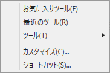
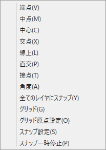

---
html:
  embed_local_images: true
  embed_svg: true
  offline: true
  toc: true
print_background: false
title: PreCad manual
---

# PreCAD （Windows） マニュアル
## 画面構成

### 1.編集画面
#### マウス操作
マウスを使って図形を[描画ツール](#DrawTools)により作図します。作図に使うマウス操作は以下のようになります。
- 左クリック
  クリックした位置で座標を指定します。ツールによっては、Shiftキーを押しながらクリックすると縦横に移動方向を拘束することができます。
- 左ダブルクリック
  ツールによっては操作終了などに使います。
- 右クリック
  メニューを表示します。ツールによっては図形選択の終了に割り当てられます。
- 左ボタンドラッグ
  ツールによっては範囲内の図形選択などに使います。
  選択ツールでは、左から右へドラッグで範囲内に全て入っている図形を選択、右から左へのドラッグで範囲内に一部でも入っている図形を選択します。
- マウスホイール
  - 回転で拡大縮小します。
  - ドラッグするとスクロールします。
  - Shiftキーを押しながらドラッグすると領域を拡大します。
  - Shiftキーを押しながらクリックでその位置を画面の中央まで移動します。

#### カーソル

- カーソルには座標値が２段表示されます。上がグリッド原点からの相対座標、下がアンカーからの相対座標です。アンカーは前回クリックした点、もしくはツールによって決まる座標です。例えば円弧ツールでは円の中心がアンカーとなります。
- 座標値は[表示メニュー](#ViewMenu)から表示のオンオフができます。
- 通常時はカーソルは青色ですが、スナップ時は赤色に変わります。スナップ時にはカーソル左上に種類を表すマークが表示されます。表示されるマークについては[スナップツールバー](#SnapToolBar)を参照してください。
- カーソルは十字のカーソルと画面の端まで線が引かれる全画面クロスカーソルがあります。切替は[表示メニュー](#ViewMenu)から行います。

### 2.メニュー
上部メニューからコマンドを実行することができます。メニューにあるコマンドは、ツールバーにも（全てではありませんが）同じコマンドがあります。

#### ファイル

1. 新規
新規作成とテンプレートから新規作成があります。
テンプレートから新規作成は、あらかじめ作ってあるファイルを元に新規ファイルを作成します。
2. 開く
ファイルオープンダイアログが開きます。
3. 保存
ファイルを保存します。まだファイル名がない場合は、ファイル保存ダイアログが開くのでファイル名を付けてください。
4. 名前を付けて保存
ファイル保存ダイアログが開います。
5. 印刷
印刷ダイアログが開きます。
6. 印刷領域設定
印刷領域設定ツールに切り替わります。カーソルの位置が印刷領域の中心になります。以下のオプションがツールパネルに表示されます。

   1. 印刷領域を用紙に合わせ、倍率を変更。
   2. 印刷領域を中央に移動。
   3. 印刷倍率。
   4. 印刷領域設定ツールを終了し、元のツールに戻ります。
1. 設定
各種設定を行います。

   1. 新規ファイル設定
   新規ファイル作成時のデフォルトの用紙と縮尺をここで設定します。
   2. ツールバーリセット
   ツールバーの配置をリセットします。再起動後にツールバーはリセットされます。   
2. 最近開いたファイル
最近開いたファイルが表示され選択できます。
3. 終了
このアプリを終了します。

#### 編集

1. 元に戻す（Undo）
編集操作などを一つ前に戻します。
2. やり直し（Redo）
元に戻す（Undo）した操作をやり直します。
3. 選択ツール
図形を選択し、移動変形するツールです([選択ツール参照](#SelectTool))。いろいろできます。
2. 切り取り
選択ツールで選択された図形を切り取りクリップボードへコピーします。
3. コピー
選択ツールで選択された図形をクリップボードへコピーします。
1. メタファイルとしてクリップボードへコピー
選択ツールで選択された図形をメタファイルとしてコピーします。
2. 貼り付け
クリップボードから図形を貼り付けます。貼り付けた図形は編集画面の中央に現れます。
2. 選択したレイヤに貼り付け
通常の貼り付けはコピー元のレイヤに貼り付けますが、これは現在選択中のレイヤに貼り付けます。
1. 形式を選択して貼り付け
各種形式（PNGなど）をダイアログから選択し、貼り付けを行います。
1. 画像挿入
画像ファイルを選んで貼り付けを行います。
1. 削除
選択ツールで選択された図形を削除します。
2. キャンセル
編集中の操作をキャンセルします（ESCキーと同じ）。
3. 検索/置換
文字列の検索と置換が行えます。

#### 表示

1. ズーム
サブメニューに縮小、拡大、用紙に合わせるがあります。
2. ステータスバー
画面下部のステータスバーの表示/非表示の切り替え。
3. 印刷領域
印刷領域の表示/非表示の切り替え。
4. 座標値
カーソルの座標値の表示/非表示の切り替え。
5. 背景色黒
背景色の白/黒の切り替え。背景色が黒の場合、線色の白と黒が切り替わります。
6. 全画面クロスカーソル
十字のカーソルと画面の端まで線が引かれる全画面クロスカーソルの切替。
7. オプション
オプション設定ダイアログが表示されます。

   1. マーカー（ドット）半径
マーカーの種類のドットの半径をここで指定します。
   1. 補助線の色
   補助線の色をここで変更できます。背景色と近い色にすると見えずらくなるので注意してください。
   2. 破線の長さの比率
   破線のピッチを変更できます。0.5から2.0までの値を入力してください。
   3. フォント
   パソコンにインストールされていないフォントが使われた場合の代替フォントを使うかをここで指定します。
   通常は指定しなくてもWindowsが適当に処理するので大丈夫ですが、Wineでは指定しないと文字化けを起こすことがあります。
   4. 背景
   編集画面の背景に画像を張ることができます。有効にしてお気に入りの画像を選んでください。
   不透明度を下げると用紙を透かして画像がよく見えます。
   5. ポリライン化
   円（円弧を含む）やスプライン（ベジェ）曲線などを線分化する時の基準をここで設定します。
   円の分割数は、円の精度と最大分割数があります。精度を0にすると、常に最大分割数で分割されます。円の最大分割数は4分の1の値を入力します（円はこの値の4倍が実際に使われる値になります）。
   これらの値は、ハッチングする時の交点検出などでも使用しているのであまり荒くすると演算の結果に影響します。
   また、細かくすると変換後のデータ量や処理時間に影響するので適当な値を設定してください。

#### ツール

[描画ツール](#DrawTools)をここから選択できます。

#### スタイル

図形のスタイルをここから設定できます。ツールバーにも同じ項目がありますので、詳細はツールバーを参照してください。

#### スナップ

スナップの設定（[スナップツールバー](#SnapToolBar)参照）。

#### 図面

レイヤ、シート、ページの設定が行えますが、[ドキュメントパネル](#DocumentPanel)や[ステータスバー](#StatusBar)のほうが使い勝手はいいと思います。

#### ヘルプ

1. マニュアル
マニュアルが開きます。
2. PreCadについて
PreCadの情報が表示されます。
3. フィードバックを送る
作者に質問等あればこちらからお願いします。メーラーが開いて宛先に作者の連絡先、件名にアプリ名とバージョンが入っているので本文を書いて下さい。
4. プラグイン情報
PreCadの機能の多くはプラグインで構成されています。その情報が表示されます。

### 3.ツールバー
#### ファイルツールバー

1. 新規作成
2. 開く
3. 上書き保存
4. ファイルを名前を付けて保存
5. 印刷
 印刷ダイアログが表示されます。プリンター、用紙などを選んで印刷ボタンを押すと印刷できます。
7. 印刷領域設定
 現在のプリンタの用紙で印刷される範囲を決定します。

#### 編集ツールバー

1. 選択ツール
図形を選択し、移動変形するツールです([選択ツール参照](#SelectTool))。いろいろできます。
2. 切り取り
選択ツールで選択された図形を切り取りクリップボードへコピーします。
3. コピー
選択ツールで選択された図形をクリップボードへコピーします。
4. 貼り付け
クリップボードから図形を貼り付けます。貼り付けた図形は編集画面の中央に現れます。
5. 元に戻す（Undo）
編集操作などを一つ前に戻します。
6. やり直し（Redo）
元に戻す（Undo）した操作をやり直します。
7. キャンセル
編集中の操作をキャンセルします（ESCキーと同じ）。

#### 線スタイルツールバー

1. 線色
  線色を選択します。[L]で[レイヤの色](#LayerStyle)が使用されます。
1. 線種
  線種を選択します。[L]で[レイヤの線種](#LayerStyle)が使用されます。[A]は印刷されない線（補助線）です。
1. 線幅
  線幅を選択します。[L]で[レイヤの線幅](#LayerStyle)が使用されます。
1. 始点矢印タイプ
1. 始点矢印サイズ
1. 終点矢印タイプ
1. 終点矢印サイズ

#### 面スタイルツールバー

1. 面色
  面色を選択します。[L]で[レイヤの色](#LayerStyle)が使用されます。

#### 文字スタイルツールバー

1. 文字色
  文字色を選択します。[L]で[レイヤの色](#LayerStyle)が使用されます。
1. フォント名
1. フォントサイズ
  単位はmmです。
4. ボールド
5. イタリック
6. 下線
7. 取り消し線
8. 設定
  設定ウィンドウが開き、その他のフォント設定を行います。

   1. 文字幅比率
   文字幅の拡大率
   2. 文字間隔
   文字と文字の間隔
   3. 傾斜角
   文字の傾斜角。右に傾く方向が正。
   4. 文字のみ傾斜
   チェックすると各文字が傾斜して背景の枠は傾斜しません。下図の1がチェック無し、2がチェックありです。

9. 文字左寄せ
10. 文字中央寄せ
11.  文字右寄せ
12.  寸法線等の設定
ここから寸法線、引出線、点などの設定が行えます。

#### ズームツールバー

1. 拡大
1. 縮小
1. 用紙全体を表示します。

#### スナップツールバー

チェックすると図形の端点などに近づいたときにカーソル位置を固定します。
1. 端点
  線の端点、多角形の頂点など。スナップ時、カーソルに「V」が表示されます。
1. 中点
  線の中点、円の1/4点など。スナップ時、カーソルに「M」が表示されます。
1. 中心
  円の中心など。スナップ時、カーソルに「C」が表示されます。
1. 交点
  同じレイヤーの線の交点。カーソルに「X」が表示されます。
1. 線上
  線の上にスナップします。カーソルに「L」が表示されます。
1. 直交
  線や円に直交する点。カーソルに「P」が表示されます。
1. 接点
  円に接する点。カーソルに「T」が表示されます。
1. 角度
  角度ごとにカーソル位置が拘束されます。スナップ時カーソルに「A」と角度が表示されます。
1. グリッド
  グリッドが表示され、カーソルがグリッドに近づくとスナップします。スナップ時カーソルに「G」が表示されます。
1. グリッド原点設定
  グリッドの原点指定モードになります。編集画面上で原点を指定したい位置でマウスをクリックしてください。
1. スナップ設定
  スナップ設定ダイアログが開きます。グリッドの分割数、角度スナップの角度を設定できます。

1. グリッドサイズ
グリッドの間隔。
2. グリッド分割数
サブグリッドの分割数。
3. グリッド角度
グリッドに傾斜角を与えることができます。
4. 縮尺有効
チェックするとグリッド間隔が実数になります。
5. 種類
グリッドの種類。直線と＋が選べます。
5. スナップ角度
角度スナップの角度をここで設定します。

### 4.ツールパネル
ここから[描画ツール](#DrawTools)を選びます。ツールはカテゴリーに分かれています。カテゴリーは、「線」、「円」、「文字」、「寸法」、「変形」、「コピー」、「計測」、「その他」です。
表示されているアイコンを押すとそのアイコンのツールが選択されます。アイコンの横の三角形ボタンを押すとカテゴリーに含まれるツールがリストと表示されるので選んでください。

### 5.ツールオプションパネル
[描画ツール](#DrawTools)で設定できる長さや角度などを数値入力するためのパネルです。

### 6.ドキュメントパネル
レイヤ、シート、ページ、パーツのタブがあります。
#### レイヤタブ
レイヤの設定や書き込むレイヤーの選択などをここで行います。

1. レイヤ追加、削除ボタン。レイヤが一つしかない時は削除できません。
2. レイヤ順移動ボタン。選択されたレイヤの順序を入れ替えます。レイヤリストでレイヤ名部分をドラッグで順序を入れ替えることもできます。
3. レイヤ表示ボタン。左から全レイヤ可視、選択以外グレー、選択レイヤのみ表示
4. メニューボタン。以下のメニューが表示されます。
  - [全ての表示可フラグをON/OFF]リスト上の表示可フラグの一括ON/OFFを行います。
  - [全ての編集可フラグをON/OFF]リスト上の編集可フラグの一括ON/OFFを行います。
  - [全ての印刷可フラグをON/OFF]リスト上の印刷可フラグの一括ON/OFFを行います。
  - [レイヤー設定]レイヤーの名称などを設定するダイアログが表示されます（このダイアログで設定できる項目はレイヤリストから直接編集できるので使うことはないかもしれません）。
5. レイヤリスト。レイヤの一覧が表示されます。レイヤはレイヤリストで下に行くほうが画面上では上に重なって表示されます。
6. レイヤ名。ダブルクリックもしくはF2きーで編集できます。編集終了はEnterキーで決定、Escキーでキャンセルです。無名や他のレイヤと同じ名称は入力できません。
7. レイヤ表示/非表示切替。非表示でも選択されているレイヤは表示されます。また非表示のレイヤは印刷もされません。
8. 編集可/編集不可切替。
9. 印刷可/印刷不可切替。

10. レイヤスタイル。クリックするとレイヤのカラー、線種、線の太さを指定できます。
  - 線色
    図形の線色をL（ByLayer）にしたときに使われる線色です。
  - 線種
    図形の線種をL（ByLayer）にしたときに使われる線種です。
  - 線幅
    図形の線幅をL（ByLayer）にしたときに使われる線幅です。

#### シートタブ
シートの設定や書き込む使用するシートの選択などをここで行います。

1. シート追加、削除ボタン。シートが一つしかない時は削除できません。
2. シート表示ボタン。左から全シート可視、選択以外グレー、選択シートのみ表示
3. メニューボタン。以下のメニューが表示されます。
  - [全ての表示可フラグをON/OFF]リスト上の表示可フラグの一括ON/OFFを行います。
  - [全ての編集可フラグをON/OFF]リスト上の編集可フラグの一括ON/OFFを行います。
  - [全ての印刷可フラグをON/OFF]リスト上の印刷可フラグの一括ON/OFFを行います。
  - [シート設定]シートの名称などを設定するダイアログが表示されます（このダイアログで設定できる項目はシートリストから直接編集できるので使うことはないかもしれません）。
4. シートリスト。シートの一覧が表示されます。
5. シート名。ダブルクリックもしくはF2きーで編集できます。編集終了はEnterキーで決定、Escキーでキャンセルです。無名や他のシートと同じ名称は入力できません。
6. シート表示/非表示切替。非表示でも選択されているシートは表示されます。また非表示のシートは印刷もされません。
7. 編集可/編集不可切替。
8. 印刷可/印刷不可切替。
9. 縮尺ボタン。クリックすると縮尺設定ダイアログが表示されます。

#### ページタブ
ページの設定や書き込むページの選択などをここで行います。

1. ページ追加、削除ボタン。ページが一つしかない時は削除できません。
2. ファイルからページ追加ボタン。クリックするとファイル選択ダイアログが開き、ファイルを選ぶとページを追加できます。
3. ページリスト。ページの一覧が表示されます。

#### パーツタブ
よく使う図形はパーツとして再利用できます。パーツはグループ図形です。

1. パーツ追加、削除ボタン。パーツを追加するには選択ツールでパーツにしたい図形を選択し、パーツ追加ボタンを押してください。選択中のパーツファイルにパーツとして追加されます。パーツファイルががまだない場合、ファイル選択ダイアログが表示されます。適当な名称でファイルを作ってください。
2. パーツファイル追加ボタン。ファイル選択ダイアログが表示されます。
3. パーツファイル削除ボタン。リストからファイルが削除されます。ファイル自体は削除されずディスクに残っています。
4. 他形式パーツインポートボタン。jw_cadのパーツ形式(jws)などを利用できます。
5. 貼り付けボタン。選択中のパーツを画面中央に貼り付けます。
6. 縮尺有効チェックボックス。チェックすると実寸で貼り付けされます。チェックが外れていると、用紙上の大きさになります。記号などはチェックを外すほうがいいでしょう。
7. パーツファイル切替。クリックするとパーツファイルを切り替えることができます。
8. パーツリスト。選択中のパーツは青枠が表示されます。パーツをダブルクリックすると画面中央に貼り付けされます。

### 7.プレビューパネル
編集画面の全体が表示されます。マウスドラッグで選択するとその範囲が編集画面に表示されます。
[図面]にチェックがあると図面表示、チェックがないとドキュメントパネルがレイヤタブの時は選択中のレイヤ、シートタブの時は選択中のシートが表示されます。

### 8.ステータスバー

1. 情報表示
  現在のツールの名称及び操作説明が表示されます。また、図形編集中のエラーもここに表示されます。
2. レイヤボタン
  現在のレイヤが表示されます。また、変更をここから行えます。
3. シートボタン
  現在のシートが表示されます。また、変更をここから行えます。
4. ページボタン
  現在のページの表示と変更をここから行えます。
5. 用紙サイズボタン
  現在の用紙サイズが表示されます。また、変更をここから行えます。

## 他形式保存／読み込み

PreCADは他のCADのファイルの保存、読み込みに対応しています。

しかし、保存も読み込みも互換性はそれほど高くありません。<u>読み込んだファイルを同じ形式で保存しても全く違う内容となってしまいます。注意してください。</u>

### jw_cad

レイヤーの構造がかなり違うので変換は難しいです。

- jwc形式は読み込みのみ対応しています。
  - レイヤグループはシートに変換されます。
  - レイヤー及びレイヤーグループは使用しているもののみ読み込まれす。
  - 線幅は反映されません。線種はPreCADの近い線種に変換されます。
- jww形式保存
  - シートはレイヤグループに変換されます。
  - グループ図形はブロック図形に変換されます。
  - 文字のフォントは「ＭＳ ゴシック」になります。
  - 各種図形の属性は保存されません。
  - カラーテーブルなどはリセットされます。色はソリッド以外は保存されません。
  - 線幅は反映されません。
- jww形式読み込み
  - レイヤグループはシートに変換されます。
  - レイヤー及びレイヤーグループは使用しているもののみ読み込まれす。
  - ブロック図形はグループ図形に変換されます。
  - 文字のフォントは反映されません。
  - 線幅は反映されません。線種はPreCADの近い線種に変換されます。
  - 貼り付けた画像は読み込まれません。

### DXF

- DXF保存
  - 線幅は反映されません。
  - 線色は基本16色になります。
  - MTEXTは複数のTEXTになります。
  - グループ図形と寸法図形は分解されて保存されます（ブロックになりません）。
  - シートの縮尺は反映されません。
  - レイヤの文字数や使用不可文字などをチェックしていません。問題があるかもしれません。
  - headerなどに必要最低限の情報しか書き込んでいません。問題があるかもしれません。

- DXF読み込み
  - 線幅は反映されません。
  - MTEXTの書式は一部対応です。
  - ブロック図形はグループ図形に変換されます。
  - 対応していない要素が多くあります。
  - 文字のフォントは反映されません。
  - 読み込み時に白色はPreCADで見えないため黒色に変換します。

## 描画ツール

図形の描画、変形などに使うツールは「線」「円」「文字」「寸法」「変形」「コピー」「計測」「その他」のカテゴリーに分かれています。「ツールパネル」もしくは「ツールメニュー」から選んでください。

また、ツールは順次追加、改良されるのでこのマニュアルと内容が異なることが多くあると思います。ツールの説明は、ツールチップやステータスバーのメッセージに表示する方向で考えています。
ツールを選ぶと以下のような数値入力用のオプションがツールオプションパネルに表示されます。

1のように数値入力欄の前にチェックボックスがあるものはチェックされたときに数値が有効となります。
2の電卓アイコンを押すと電卓が表示され計算結果を入力できます。
### 線カテゴリー

#### 線 

２点を指定して線を引きます。オプションより線の長さ・角度を指定することができます。

##### オプション

- 長さ
  チェックすると長さを指定できます。
- 角度
  チェックすると角度を指定できます。

#### 連続線 

点を続けて指定して線を引きます。終了は「終了」ボタンもしくはダブルクリックです。Escキーで一つ前の点に戻ります。
ポリラインにチェックを入れるとポリラインとなり面の色を指定できます。

##### オプション

- 長さ
  チェックすると長さを指定できます。
- 角度
  チェックすると角度を指定できます。
- 閉じる
  チェックすると始点と終点が閉じた図形になります。
- ポリライン
  チェックするとポリラインになります。ポリラインは面の色を指定できます。
- 終了
  描画を終了します。

#### 四角形 

長方形を描きます。オプションの中心にチェックがない場合は、２つの頂点を指定します。中心にチェックがある場合は中心と頂点を指定します。

##### オプション

 

 - 幅
  チェックすると長方形の幅を指定できます。
- 高さ
  チェックすると長方形の高さを指定できます。
- ポリライン
  チェックするとポリラインになります。ポリラインは面の色を指定できます。
- 中心
  チェックすると中心点と端点を指定して描画します。

#### 多角形 

正多角形を描きます。

##### オプション
 

- 辺
  多角形の辺数
- 長さ
  チェックすると有効になります。モードにより以下の意味になります。
  - 中心->頂点
    中心から頂点までの距離
  - 中心->辺
    中心から辺までの距離
  - 底辺
    底辺の長さ
- 角度　チェックすると有効になります。モードにより、
  - 中心->頂点
  中心から頂点の角度
  - 中心->辺
  中心から辺の角度
  - 底辺
  底辺の角度
- ポリライン
  チェックするとポリラインになります。ポリラインは面の色を指定できます。
- モード
中心->頂点、中心->辺、底辺の3モードがあります。

#### 二重線 
2本の平行な線を引きます。Ctrlキーをすと始点とX座標もしくはY座標が同じ位置を指定できます。

##### オプション

 

- ギャップ
  線と線の間隔
- 長さ
  チェックすると長さを指定できます。
- 角度
  チェックすると角度を指定できます。
- ポリライン
  チェックするとポリラインになります。
- 端点タイプ
  線端の処理を指定します。
  - 開く：両端は接続されません
  - 閉じる：始点と終端が接続された2本の閉じた線になります。
  - 終端閉じ：始点、終点それぞれ接続された1本の閉じた線になります。
- 終了
  描画を終了します。

#### フリーハンド 
マウスの動きになぞって線を描きます。線はポリラインです。

##### オプション

 

- 間隔
  マウスの移動距離がこの値以上になるとポリラインに点を追加します。この値を小さくするとデータ量が増えるのであまり小さくしないでください。
- 閉じる
  始点と終点を閉じます。
- スナップ無効
  スナップが描画の邪魔をするときはチェックしてください。

#### スプライン 
カーディナルスプラインを描画します。

##### オプション

 

- 閉じる
  チェックすると始点と終点が閉じた図形になります。
- 終了
  描画を終了します。

#### 直交線 
選択された線・円に垂直な線を引きます。
1. 線または円を選択
2. 始点、終点を指定
##### オプション

 

- 長さ
  チェックすると長さを指定できます。

#### 平行線 
選択された線に平行な線を引きます。
1. 線を選択
2. 選択した線からの距離を指定
3. 始点、終点を指定
##### オプション

 

- 長さ
  チェックすると長さを指定できます。

#### 中間線 

選択された2本の線の中間の線を引きます。

1. 2本線を選択
2. 始点、終点を指定

##### オプション

 

- 長さ
  チェックすると長さを指定できます。

#### 接線 
円の接線を引きます。
1. 円を選択
2. 始点、終点を指定
##### オプション

- 長さ
  チェックすると長さを指定できます。
- 角度
  チェックすると角度を指定できます。

#### 円と円に接する線 
円と円に接する線を描きます。接線はそれぞれの円を選択した点近傍から引かれます。

#### 円の中心線 
選択した円の中心線を描きます。
1. 円を選択
2. 中心線の長さを指定
##### オプション

- 比率[%]
  チェックすると中心線の長さを直径の比率で指定できます。

#### 破断線 

破断線を描画します。

##### オプション

- 種類
  破断線の種類です。ジグザグ、波線、Sが選べます。
- サイズ
  目安程度に考えてください。

### 円カテゴリー

#### 円 
中心と半径を指定して円を描きます。
##### オプション

- 半径
  チェックすると半径を指定できます。

#### 3点円 
3点を通過する円を描きます。
##### オプション

- 半径
  チェックすると半径を指定できます。3点目は円の向きになります。

#### 楕円 
中心、半径、扁平率、角度を指定して楕円を描きます。
##### オプション

- 半径
  チェックすると半径を指定できます。
- 扁平率
  チェックすると扁平率を指定できます。
- 角度
  チェックすると楕円の傾きを指定できます。

#### 楕円（２点） 
2点を指示して楕円を描きます。
##### オプション

- 幅
  チェックすると幅を指定できます。
- 高さ
  チェックすると高さを指定できます。
- 中央
  チェックすると中心と頂点の指定となります。

#### 線に接する円 
1つの線または円に接する円を描きます。
1. 線または円を選択
2. 中心点を指定
##### オプション

- 半径
  チェックすると半径を指定できます。

#### 2線接円 
2つの線または円に接する円を描きます。
1. 2つの線または円を選択
2. 通過点を指定
##### オプション

- 半径
  チェックすると半径を指定できます。

#### 3線接円 
3つの線または円に接する円を描きます。
1. 3つの線または円を選択。すべて線の場合はここで円が描画さ終了します。
2. 描画可能な複数の円から目的とするものを選択

#### 2線に接する楕円 
平行四辺形を構成する2つの線に接する楕円を描きます。

#### 円弧 
中心、半径、始角、角幅を指定して円弧を描きます。
##### オプション

- 半径
  チェックすると半径を指定できます。
- 始角
  チェックすると始角を指定できます。
- 角幅
  チェックすると角幅を指定できます。

#### 3点円弧 
始点、終点、通過点を指定して円弧を描きます。
##### オプション

- 半径
  チェックすると半径を指定できます。

#### 半円 
始点、終点、向きを指定して半円を描きます。
##### オプション

- 半径
  チェックすると半径を指定できます。
- 角度
  チェックすると半円の傾きを指定できます。

#### 1/4円 
中心、終点、向き指定して半円を描きます。
##### オプション

- 半径
  チェックすると半径を指定できます。
- 角度
  チェックすると半円の傾きを指定できます。

### 文字カテゴリー

#### 文字 
一行の文字を描きます。
文字はスタイルの「面」の色で背景色を指定することができます。
フォントの問題で、文字は機種により書体や大きさが変わる可能性があります。大きさなどに余裕を持て配置してください。

##### オプション

- 文字入力エリア
- テキスト基準
  文字を配置する基準点。
- 角度
- 縦書き
  チェックすると縦書きになります。

#### 複数行文字 
複数行の文字を描きます。
文字はスタイルの「面」の色で背景色を指定することができます。
フォントの問題で、文字は機種により書体や大きさが変わる可能性があります。大きさなどに余裕を持て配置してください。
##### オプション

- 文字入力エリア
- 文字配置基準
  文字を配置する基準点。中央、左下などを設定できます。
- 角度
- 縦文字
  チェックすると縦書きになります。

#### 引き出し線 
引き出し線を描きます。
##### オプション

- 文字入力エリア。
- 設定
  引き出し線設定ダイアログが開きます。

#### バルーン 
バルーンを描きます。
##### オプション

- 文字入力エリア。
- 設定
  引き出し線設定ダイアログが開きます。

### 寸法カテゴリー

#### 寸法 
寸法図形を描きます。
##### オプション

- 種類
  - 通常: 拘束なし
  - 水平: 水平に拘束された寸法線
  - 垂直: 垂直に拘束された寸法線
  - 水平垂直: 水平・垂直に拘束された寸法線
- 連続
  チェックすると前回の点から続けて寸法線を描きます。Escキーで終了します。
- 中央
  チェックすると寸法値を寸法線の中心に描画します。
- 文字
  チェックすると任意の文字を寸法線に描画します。
- 設定
  寸法線設定ダイアログを開きます。
- 許容差
    種類　許容値の表示方法（None:表示無し 　One line:一行（±）　Two lines:2行）
    値　許容値
    小数点以下　小数点以下の桁数
    後置文字　許容値の後ろにつける文字

#### 直径 
円の直径寸法を描きます。
1. 円を選択
2. 寸法図形の角度、文字位置を指定
##### オプション

- 中心
  チェックすると寸法値を寸法線の中心に描画します。
- 文字
  チェックすると任意の文字を寸法線に描画します。
- 設定
  寸法線設定ダイアログを開きます。
- 許容差
    種類　許容値の表示方法（None:表示無し 　One line:一行（±）　Two lines:2行）
    値　許容値
    小数点以下　小数点以下の桁数
    後置文字　許容値の後ろにつける文字

#### 半径 
円の半径寸法を描きます。
1. 円を選択
2. 寸法図形の角度、文字位置を指定
##### オプション

- 中心
  チェックすると寸法値を寸法線の中心に描画します。
- 文字
  チェックすると任意の文字を寸法線に描画します。
- 設定
  寸法線設定ダイアログを開きます。
- 許容差
    種類　許容値の表示方法（None:表示無し 　One line:一行（±）　Two lines:2行）
    値　許容値
    小数点以下　小数点以下の桁数
    後置文字　許容値の後ろにつける文字

#### 角度 
中心と引出点2点と文字位置を指定して角度図形を描きます。
##### オプション

- 中心
  チェックすると寸法値を寸法線の中心に描画します。
- 文字
  チェックすると任意の文字を寸法線に描画します。
- 設定
  寸法線設定ダイアログを開きます。
- 許容差
    種類　許容値の表示方法（None:表示無し 　One line:一行（±）　Two lines:2行）
    値　許容値
    小数点以下　小数点以下の桁数
    後置文字　許容値の後ろにつける文字

#### 2線間角度 
2線間の角度図形を描きます。
1. 線を2本選択
2. 文字位置を指定
##### オプション

- 中心
  チェックすると寸法値を寸法線の中心に描画します。
- 文字
  チェックすると任意の文字を寸法線に描画します。
- 設定
  寸法線設定ダイアログを開きます。
- 許容差
    種類　許容値の表示方法（None:表示無し 　One line:一行（±）　Two lines:2行）
    値　許容値
    小数点以下　小数点以下の桁数
    後置文字　許容値の後ろにつける文字

#### 線の寸法 

選択した線の長さ、円の直径を描きます。
1. 線・円を選択
2. 文字位置を指定
  

- 設定
  寸法線設定ダイアログを開きます。
- 許容差
    種類　許容値の表示方法（None:表示無し 　One line:一行（±）　Two lines:2行）
    値　許容値
    小数点以下　小数点以下の桁数
    後置文字　許容値の後ろにつける文字

#### 寸法線傾斜 

寸法線を傾斜させます。寸法線を選択後、傾斜させる角度を指定します。文字も一緒に傾斜させるか選ぶことができます。アイソメ図の寸法作成に使えます。

##### オプション

- 文字傾斜

### 変形カテゴリー

#### コーナー 

2本の線または円弧を選択するとつなげて角を作ります。

#### 面取り 

2線の面取り
1. 線を2本選択
2. 面取りのサイズを指定
##### オプション

 

- 長さ
  チェックすると面取りのサイズを指定できます。

#### 角丸め 

2本の線または円弧を選択するとつなげて角を丸めます。
1. 線を2本選択
2. 角丸めの半径を指定

##### オプション

- 半径
  チェックすると半径を指定できます。

#### 線延長 

まず線を選択します。次に選択する線を最初に選択した線に接するように延長・短縮します。
１本目の図形は線、円、円弧、ポリラインが選択できます。２本目は線、円弧が選択できます。

#### 線消去 

選択した線・円を他の図形の交点まで削除します。

#### 線切断 

2点で矩形を指定し、その間の線を消去します。

#### トリム 

2点で矩形を指定し、その中の線の端点・交点を切断・接続します（包絡処理）。

#### 演算 

2つの円や閉じたポリラインなどの間で演算を行います。演算はAND、OR,SUBがあります。オプションから選んでください。演算結果は閉じたポリラインになります。円の一部などは分割された線分になります。

#### ストレッチ 

2点で矩形を指定し、その中の線の端点を延ばします。
1. 端点を含む領域を2点で指定します。
2. 基準点を指定します。
3. 延長点を指定します。

#### 選択ツール 

- 図形を選択し、移動・変形などを行います。グループ図形化やパーツ化などもこれで行います。
- 図形の選択は直接図形をクリックして選択する方法と、2点で囲む方法があります。
- 2点で囲む場合、左から右に囲むとその範囲に全体が入った図形が選択されます。右から左に選択すると、図形の一部が範囲に入っていると選択されます。
- 選択された図形をドラッグして図形を移動します。
- 選択された図形にはハンドルが表示され、そのハンドルをドラッグすると拡大縮小となります。「ハンドル移動」にチェックがある場合はハンドルドラッグで移動になります。
- Ctrlキーを押しながら移動・拡縮すると元の図形が残ります（コピー）。
- Shiftキーを押しながら移動時は移動方向が縦横に拘束されます。ハンドルドラッグで拡縮時は縦横比を固定します。

##### オプション

- モード
   1. ハンドルドラッグで移動
  通常はハンドルドラッグで拡大縮小ですが、オンにすると拡大縮小せずに移動となります。
    1. 頂点編集モード
  通常はハンドルは図形の矩形領域の外形上ですが、オンにするとポリラインなどの頂点にハンドルが表示されます。このモードではポリラインの頂点編集を行えます。
    1. 連続線選択モード
  オンにすると、クリックした線に接続している線を一括で選択できます。
- 変形
    1. 左右反転
  クリックすると選択された図形を左右反転します。
    1. 上下反転
  クリックすると選択された図形を上下反転します。
    1. 左回転
  クリックすると選択された図形を90度左に回転します。
    1. 右回転
  クリックすると選択された図形を90度右に回転します。
  クリックすると選択された図形を90度右に回転します。
    1. 回転
  クリックすると回転角度入力ダイアログが表示され、角度を指定して回転できます。
    1. 移動
  クリックすると移動座標入力ダイアログが表示され、相対座標を指定して移動できます。
    1. サイズ変更
  クリックするとサイズ変更ダイアログが表示され、倍率を指定して拡縮できます。
    1. せん断
    せん断変形を行います。クリックするとダイアログが表示され、せん断の種類が選択できます。

- 変換
    1. グループ化
    クリックすると選択された図形をグループ図形に変換します。
    1. グループ化解除
    クリックすると選択されたグループ図形をグループ解除します。
    1. ポリライン化
    クリックすると選択された図形をポリラインに変換します。
    1. 線分化
  クリックすると選択された図形を線分に分解します。

- 順序
    1. 最上面
    クリックすると選択された図形の重なり順序を最上面に移動します。
    1. 最下面
    クリックすると選択された図形の重なり順序を最下面に移動します。
    1. レイヤ変更
  クリックするとレイヤ変更ダイアログが表示され選択された図形を他のレイヤに移動します。

- 整列
  選択された図形群を整列します。

- 配置
  選択された図形群を均等配置します。

### コピーカテゴリー

#### オフセット 

線や円をオフセットします。

##### オプション

- ギャップ
  オフセットする間隔を指定できます。
- コピー
  チェックすると元の図形を残します。
- 書式コピー
  チェックすると元の図形の線色が使われます。チェックがないと現在の線色などが使用されます。
- 再実行
  前回実行された間隔でオフセットが実行されます。

#### 線上コピー 

選択された図形を直線状にコピーします。
1. 図形を選択し、右ボタンで選択を終了します。基準点は右ボタンを押した点になります。
2. コピーの終点を指定

##### オプション

- コピー数
- 間隔
  コピーする間隔を指定できます。

#### 円上コピー 

選択された図形を円状にコピーします。
1. 図形を選択し、右ボタンで選択を終了します。基準点は右ボタンを押した点になります。
2. コピーされる図形の中心点を指定します。

##### オプション

- 半径
  円状にコピーする半径を数値で指定できます。
- 回転
  チェックすると図形が回転します。
- コピー数
  
#### 配列コピー 

選択された図形を縦横にコピーします。
1. 図形を選択し、右ボタンで選択を終了します。基準点は右ボタンを押した点になります。
2. コピーの終点を指定します。

##### オプション

- 列
  列方向のコピー数
- 行
  行方向のコピー数
- 列間隔
  コピーする列の間隔を指定できます。
- 行間隔
  コピーする行の間隔を指定できます。

#### 回転 

図形を回転します。
1. 図形を選択し、右ボタンで選択を終了します。基準点は右ボタンを押した点になります。
2. 図形の中心点を指定
3. 回転する角度を指定

##### オプション

- 角度
  チェックすると角度を指定できます。
- コピー
  チェックすると元の図形を残します。

#### 基準線コピー 

左右反転コピー・傾き補正を行います。
1. 図形を選択し、右ボタンで選択を終了します。
2. 基準線の始点、終点を指定します。
##### オプション

- コピー
  チェックすると元の図形を残します。
- タイプ
  - ミラー　基準線に対して左右反転します。
  - 水平　基準線を水平にするように回転します。傾き補正に使用します。
  - 垂直　基準線を垂直にするように回転します。傾き補正に使用します。

#### 交点コピー 
図形の交点にコピーした図形を配置します。
1. 図形を選択し、右ボタンで選択を終了します。基準点は右ボタンを押した点になります。
2. 交点を見つける図形を選択してください。右ボタンで選択終了し、コピーが実行されます。

#### 等間隔コピー 
図形と図形の間を等間隔に複製します。直線、円、円弧が対象です。
対象図形が直線の場合、間隔を等分するか、角度を等分するかオプションから選択できます。
1. コピーする図形を2つ選択します。2つ目に選択する図形は1つめと同じ図形である必要があります。

### 計測カテゴリー

#### 計測（線） 

２点間の距離と角度を計測します。

#### 計測（面積） 

複数の点で囲まれた領域の面積と長さを計測します。

#### 計測（図形） 

図形の面積・長さを計測します。

### その他カテゴリー

#### 点 
点を打ちます。

##### オプション

- 角度
  点の傾き。
- 仮点
  チェックすると補助線種が使用されます（印刷されません）。
- 設定
  設定ダイアログを開きます。点の種類と大きさを選ぶことができます。点の種類で「dot」は画面の拡大率にかかわらず同じ大きさで表示されます（大きさを指定できません）。

#### 分割点 

線や円を当分割した点を打ちます。

##### オプション

- 分割数
  - 仮点
  チェックすると補助線種が使用されます（印刷されません）。
- 設定
  設定ダイアログを開きます。点の種類と大きさを選ぶことができます。点の種類で「dot」は画面の拡大率にかかわらず同じ大きさで表示されます（大きさを指定できません）。

#### ハッチング 

ハッチングを作成します。ハッチングはグループ図形になります。
1. ハッチング領域を選択します。ハッチング領域は閉じている必要はありませんが多くの場合失敗します。
2. 右ボタンクリックでハッチングを実行します。右ボタンを押した点がハッチングの基準点となります。

##### オプション

- 種類
  ハッチングの種類を選択します。
- ピッチ
  ハッチングのピッチ
- 角度
  ハッチングの角度
- 間隔
  2本や3本のハッチングスタイルの線と線の間隔

#### 座標ファイル 
座標ファイルを読み込むと、その座標を線で結んだ図形がカーソル位置を原点に描かれるツールです。
座標ファイルは、一行ごとにスペースで区切られたXY座標で構成されます。
詳細は、オプションからサンプルファイルを読み込むことができるのでそれを見てください。

#### Script 
Jw_cadの線記号ファイルを読み込んで利用できます。
##### オプション

1. ファイルを開くボタン
クリックするとファイルオープンダイアログが表示されます。
2. 開いたファイル名が表示されます。
3. タイトル
4. ファイルを開くと、アイコンが表示され、選択するとその機能を実行できます。
  
#### Milling G-Code(実験中) 
卓上CNCフライスの平面切削用のGコードを作成します。現在実機検証する機会がないので、シミュレータのみで確認しています。